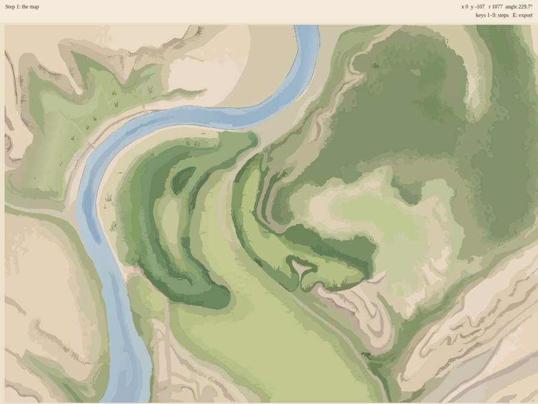
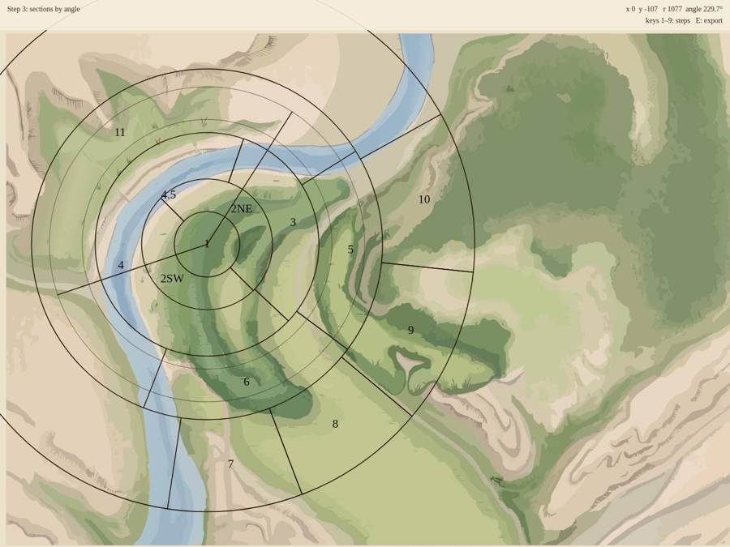
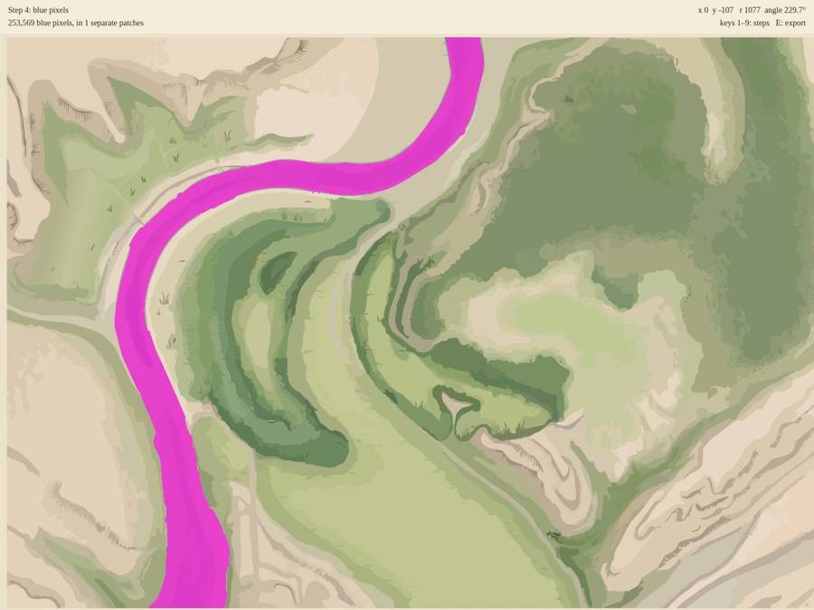
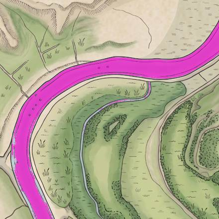
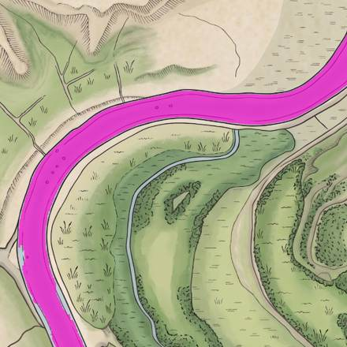
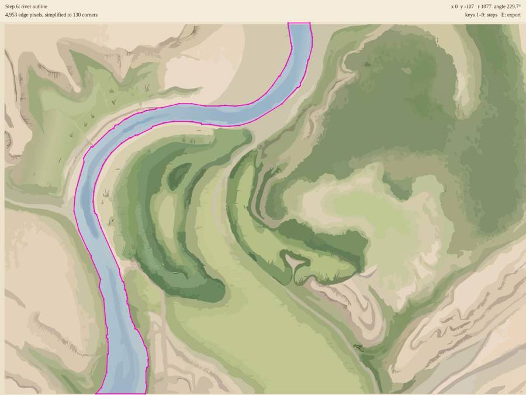
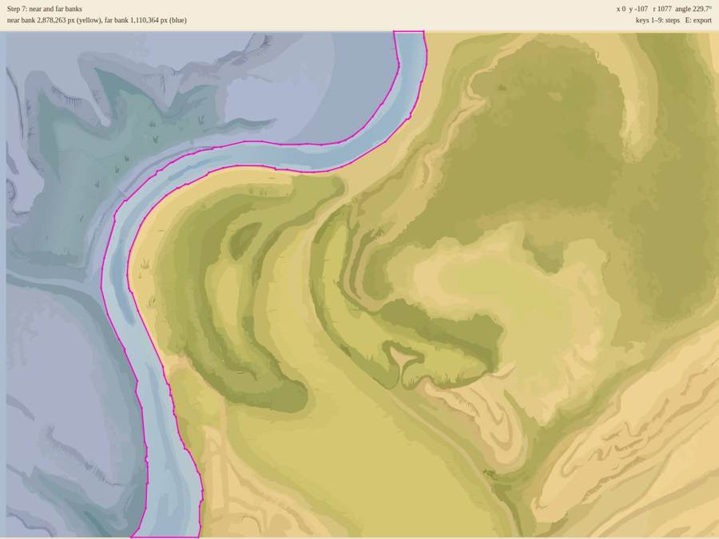
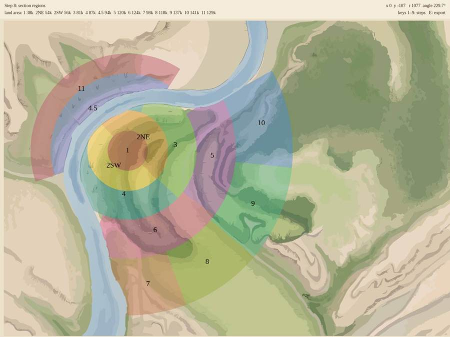
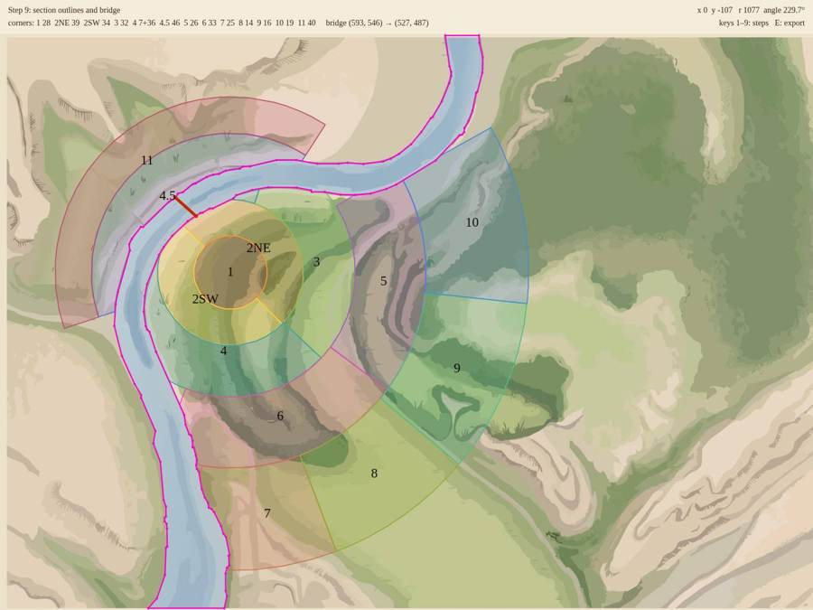

# Building geometry.js, step by step

`geometry.js` holds everything the simulation knows about the map: the centre, the ring radii, the thirteen sections as land-only outlines, the bridge, and the river outline. I made the current one with Python scripts. This tutorial rebuilds it in p5, as a **workbench** sketch: one step at a time, with each step drawn over the map so you can see exactly what it produced.

The workbench never touches your `geometry.js`. Its last step saves a new file, `geometry_built.js`, so you can compare the two. I checked the finished workbench against the current file: the river outlines overlap by 98.7%, and every section by 98.4–99.6%. The small differences come from tracing outlines a slightly different way.

## How it's organized

Everything is in one file, `workbench.js`, and it runs in its own folder, next to a copy of `basemap.svg`:

```
geometry-workbench/
  index.html        loads p5 and workbench.js
  workbench.js
  basemap.svg
  basemap.jpg       optional, for one experiment in Step 5
```

Serve the folder the same way as the clock (`python3 -m http.server`) and open `localhost:8000`.

Keys 1–9 switch between steps. Each step keeps its results in an object called `R`, and a step computes its results the first time you ask for it, along with any earlier steps it depends on. The bar at the top shows the step's name, one line of numbers about what it found, and where the mouse is on the map: its map coordinates, and its distance and angle from the city centre. That readout is the tool for checking any number in this file by hand.

To build it yourself, start with Step 0, check it runs, then add each step's code in order. Every step has three parts:

1. the new code, which goes at the end of `workbench.js`;
2. one line to add inside `drawStep()`, so the step's result is drawn;
3. for Steps 4–9, one line to add inside `prepare()`, so the step runs when needed.

The finished file is in the zip if you'd rather read along.

---

## Step 0: the scaffold

The sketch draws the whole map fitted to the window, and everything after this is drawn *in map pixels*, the same coordinates as `geometry.js`. `view` records how map pixels become screen pixels, so the mouse can be converted back.

```js
const MAP_W = 2454, MAP_H = 1728;      // every coordinate below is in these map pixels
const MAP_FILE = 'basemap.svg';

let mapImg, mapReady = false;
let step = 1;
let view;                               // { s, ox, oy }: map → screen
const BAR = 58;                         // height of the text bar at the top
```

The map is loaded as a plain browser image rather than with p5's `loadImage`, for the same reason as in the clock: p5 would flatten the SVG to fixed pixels.

```js
function preload() {
  mapImg = new Image();                 // a plain browser image, so the SVG stays sharp
  mapImg.onload = () => { mapReady = true; };
  mapImg.src = MAP_FILE;
}
```

```js
function setup() {
  createCanvas(windowWidth, windowHeight);
  textFont('Georgia');
}
```

`draw()` fits the map to the window, then switches to map coordinates with `translate` and `scale`. Everything drawn inside the `push()`/`pop()` pair is in map pixels.

```js
function draw() {
  background(236, 226, 204);
  // Fit the whole map in the window.
  const s = min(width / MAP_W, (height - BAR) / MAP_H);
  view = { s, ox: (width - MAP_W * s) / 2, oy: BAR + (height - BAR - MAP_H * s) / 2 };
  push();
  translate(view.ox, view.oy); scale(view.s);        // draw in map pixels from here on
  if (mapReady) drawingContext.drawImage(mapImg, 0, 0, MAP_W, MAP_H);
  drawStep();
  pop();
  drawHud();
}
```

```js
function mouseMap() { return { x: (mouseX - view.ox) / view.s, y: (mouseY - view.oy) / view.s }; }
```

The bar at the top: the step name, the step's numbers, and the mouse readout. `CITY_CENTER` arrives in Step 2; until then, put a temporary `const CITY_CENTER = { x: 696, y: 715 };` at the top so this runs.

```js
function drawHud() {
  const m = mouseMap();
  const r = dist(m.x, m.y, CITY_CENTER.x, CITY_CENTER.y);
  const a = (degrees(atan2(m.y - CITY_CENTER.y, m.x - CITY_CENTER.x)) + 360) % 360;
  noStroke(); fill(245, 238, 222, 230); rect(0, 0, width, BAR);
  fill(58, 38, 24); textSize(14); textAlign(LEFT, CENTER);
  text(`Step ${step}: ${STEP_NAMES[step]}`, 14, 18);
  text(INFO[step] || '', 14, 40);                  // what this step found
  textAlign(RIGHT, CENTER);
  text(`x ${m.x.toFixed(0)}  y ${m.y.toFixed(0)}   r ${r.toFixed(0)}  angle ${a.toFixed(1)}°`, width - 14, 18);
  text('keys 1–9: steps   E: export', width - 14, 40);
  if (busy) { textAlign(CENTER, CENTER); textSize(22); text('working…', width / 2, height / 2); }
}
```

```js
const STEP_NAMES = {
  1: 'the map', 2: 'rings', 3: 'sections by angle', 4: 'blue pixels',
  5: 'clean river mask', 6: 'river outline', 7: 'near and far banks',
  8: 'section regions', 9: 'section outlines and bridge',
};
```

```js
function keyPressed() {
  if (key >= '1' && key <= '9') { step = Number(key); prepare(step); }
  if (key === 'e' || key === 'E') exportGeometry();
}
```

The two functions that grow with each step start empty. Add `const R = {}, INFO = {}; let busy = false;` and:

```js
function drawStep() {
}

function prepare(n) {
  if (!mapReady || n < 4) return;
  busy = true;
  setTimeout(() => {             // let the "working…" message draw first
    // one line per step goes here
    busy = false;
  }, 30);
}
```

`prepare()` runs the heavy pixel steps a moment later, so the "working…" message gets a chance to appear first. `keyPressed` already includes the E key for exporting, but `exportGeometry` only arrives at the end, so don't press E until then.

**What you should see:** the whole map, and the mouse readout changing as you move. Hover over the middle of the inner loop of the river bend; the city centre is at x 696, y 715.



---

## Step 2: rings

These are the one set of numbers measured by hand. I fitted circles to the rings you drew on the annotated sketch, made them share one centre, and later adjusted them as we changed the plan: 2 split, 4.5 moved inland, 11 and 12 merged. No image processing can recover a design decision, so they're written down directly:

```js
const CITY_CENTER = { x: 696, y: 715 };
const RING_R = [110, 220, 376, 590, 900];   // outer radius of rings 1–5
const FAR_INNER_R = 420;                    // 4.5 reaches this far inland; 11 starts here
const FAR_OUTER_R = 530;                    // outer limit of 11 (the merged 11/12)
```

```js
function drawRings() {
  noFill(); stroke(40, 20, 10); strokeWeight(3);
  for (const r of RING_R) circle(CITY_CENTER.x, CITY_CENTER.y, 2 * r);
  stroke(40, 20, 10, 120); strokeWeight(2);
  for (const r of [FAR_INNER_R, FAR_OUTER_R]) circle(CITY_CENTER.x, CITY_CENTER.y, 2 * r);
}
```

In `drawStep()`, add:

```js
if (step >= 2 && step <= 3) drawRings();
```

**What you should see:** five dark rings around the centre, and two fainter ones for the far bank (4.5 out to 420 px, 11 out to 530 px). Put the mouse on a ring and the readout's `r` should match its radius.


---

## Step 3: sections by angle

Each section is described by a rule: which bank of the river it's on, an inner and outer radius, and a range of angles. Angles are in degrees measured **clockwise from east**, because y points down on a screen: 0° is east, 90° south, 180° west, 270° north. A sector runs clockwise from `a0` to `a1`. When `a0` is bigger than `a1`, the sector wraps through east: section 3 runs from 289.1°, just east of north, round through 0° (east) to 43.3°.

The divider angles were measured from the lines on your annotated sketch.

```js
const SECTION_RULES = [   // id, bank, inner radius, outer radius, a0, a1
  ['1',   'near', 0,           RING_R[0],   0,     360],
  ['2NE', 'near', RING_R[0],   RING_R[1],   225,   45],
  ['2SW', 'near', RING_R[0],   RING_R[1],   45,    225],
  ['3',   'near', RING_R[1],   RING_R[2],   289.1, 43.3],
  ['4',   'near', RING_R[1],   RING_R[2],   43.3,  289.1],
  ['4.5', 'far',  0,           FAR_INNER_R, 161.3, 302.7],
  ['5',   'near', RING_R[2],   RING_R[3],   327.9, 36.8],
  ['6',   'near', RING_R[2],   RING_R[3],   36.8,  111.2],
  ['7',   'near', RING_R[3],   RING_R[4],   69.2,  98.5],
  ['8',   'near', RING_R[3],   RING_R[4],   40.0,  69.2],
  ['9',   'near', RING_R[3],   RING_R[4],   6.0,   40.0],
  ['10',  'near', RING_R[3],   RING_R[4],   330.9, 6.0],
  ['11',  'far',  FAR_INNER_R, FAR_OUTER_R, 161.3, 302.7],
];
```

The palette gives each section its own colour in later steps:

```js
const PALETTE = [[230,90,60],[240,160,50],[250,210,60],[120,190,90],[60,160,170],[90,110,210],
                 [170,90,200],[220,90,150],[200,120,80],[150,170,60],[80,190,140],[70,140,220],[190,80,110]];
```

Two small helpers do the angle arithmetic. `inSector` handles the wrap-around case, and `atAngle` finds the point at a given angle and distance from the centre:

```js
function inSector(a, a0, a1) {
  if (a0 === 0 && a1 === 360) return true;
  return a0 > a1 ? (a >= a0 || a < a1) : (a >= a0 && a < a1);
}
```

```js
function atAngle(a, r) {
  return { x: CITY_CENTER.x + r * cos(radians(a)), y: CITY_CENTER.y + r * sin(radians(a)) };
}
```

```js
function drawDividers() {
  stroke(40, 20, 10); strokeWeight(3);
  for (const [, , r0, r1, a0, a1] of SECTION_RULES) {
    if (a0 === 0 && a1 === 360) continue;
    for (const a of [a0, a1]) { const p = atAngle(a, max(r0, 1)), q = atAngle(a, r1); line(p.x, p.y, q.x, q.y); }
  }
  noStroke(); fill(20, 10, 5); textSize(40); textAlign(CENTER, CENTER);
  for (const [id, , r0, r1, a0, a1] of SECTION_RULES) {
    const span = (a1 - a0 + 360) % 360 || 360;
    const p = atAngle(a0 + span / 2, id === '1' ? 0 : (r0 + r1) / 2);
    text(id, p.x, p.y);
  }
}
```

In `drawStep()`, add:

```js
if (step === 3) drawDividers();
```

**What you should see:** your sketch's layout, redrawn from numbers. Hover along a divider and the readout's angle should match the number in `SECTION_RULES`.

At this point the sections are just wedges of rings. They cross the river and ignore which bank they're on. Steps 4–8 fix that, by working out from the map's own pixels where the river is.



---

## Step 4: find the blue pixels

The map is drawn once into an off-screen canvas at full size, and its pixels are read back as one long list: red, green, blue, alpha, then the next pixel. A **mask** is a list with one entry per pixel: 1 if the pixel belongs to something, 0 if not. Pixel `(x, y)` is entry `y × 2454 + x`.

```js
function mapPixels() {
  const c = document.createElement('canvas'); c.width = MAP_W; c.height = MAP_H;
  const ctx = c.getContext('2d');
  ctx.drawImage(mapImg, 0, 0, MAP_W, MAP_H);
  return ctx.getImageData(0, 0, MAP_W, MAP_H).data;   // [r, g, b, a, r, g, b, a, …]
}
```

A pixel counts as river if it's clearly bluer than it is red or green:

```js
function stepBlue() {
  const px = mapPixels();
  const blue = new Uint8Array(MAP_W * MAP_H);
  for (let i = 0; i < blue.length; i++) {
    const r = px[4 * i], g = px[4 * i + 1], b = px[4 * i + 2];
    blue[i] = (b > r + 20 && b > g + 5) ? 1 : 0;      // clearly bluer than it is red or green
  }
  R.blue = blue;
  R.blueImg = maskImage(blue, [255, 0, 200, 170]);
  INFO[4] = `${count(blue).toLocaleString()} blue pixels, in ${regions(blue).sizes.length - 1} separate patches`;
}
```

`maskImage` turns a mask into a see-through p5 image for drawing, and `count` totals a mask:

```js
function maskImage(mask, rgba) {
  const img = createImage(MAP_W, MAP_H); img.loadPixels();
  for (let i = 0; i < mask.length; i++) if (mask[i]) img.pixels.set(rgba, 4 * i);
  img.updatePixels();
  return img;
}
```

```js
function count(mask) { let n = 0; for (let i = 0; i < mask.length; i++) n += mask[i]; return n; }
```

`stepBlue` also counts separate blue patches with `regions()`, which arrives in Step 5. Leave that `INFO` line out for now, or add Step 5's helpers first.

In `prepare()`, add `if (n >= 4 && !R.blue) stepBlue();` and in `drawStep()`:

```js
if (step === 4 && R.blueImg) image(R.blueImg, 0, 0);
```

**What you should see:** the river in magenta. Your vector map has flat colour, so all of it comes out as a single patch of about 254,000 pixels. On the watercolour JPG it's much messier; see the experiment in Step 5.



---

## Step 5: clean it into one solid river

Four operations, each simple on its own:

- **Close** (grow by 4 px, then shrink by 4 px): joins bits separated by narrow gaps, such as the drawn lines and ripple marks inside the water.
- **Fill holes:** any non-river pixel that can't be reached from the edge of the image without crossing river is a hole, and becomes river. This removes islands and specks.
- **Keep the largest region:** throws away ponds and stray blue bits elsewhere on the map.
- **Open** (shrink by 2 px, then grow by 2 px): removes thin spurs.

```js
function stepCleanRiver() {
  let m = closeMask(R.blue, 4);           // bridge small gaps (ripples, drawn lines)
  m = fillHoles(m);                       // islands and specks inside the water
  m = largestRegion(m);                   // drop the pond and stray blue bits
  m = openMask(m, 2);                     // shave off thin spurs
  R.riverMask = m;
  R.riverImg = maskImage(m, [255, 0, 200, 170]);
  let added = 0, removed = 0;
  for (let i = 0; i < m.length; i++) { if (m[i] && !R.blue[i]) added++; if (!m[i] && R.blue[i]) removed++; }
  INFO[5] = `one river of ${count(m).toLocaleString()} pixels: ${added.toLocaleString()} filled in, ${removed.toLocaleString()} blue pixels dropped`;
}
```

Growing a mask by `r` pixels means: a pixel becomes 1 if any pixel within `r` of it is 1. Checking every neighbour of every pixel would be slow, so `dilate` does it in two passes. First, along each row, it keeps a running count of set pixels in a window of width 2r + 1 as it slides. Then it does the same down each column. Shrinking is growing the background:

```js
function dilate(mask, r) {
  const W = MAP_W, H = MAP_H, tmp = new Uint8Array(W * H), out = new Uint8Array(W * H);
  for (let y = 0; y < H; y++) {           // horizontal: any set pixel within r?
    let count = 0;
    for (let x = -r; x < W; x++) {
      if (x + r < W && mask[y * W + x + r]) count++;
      if (x - r - 1 >= 0 && mask[y * W + x - r - 1]) count--;
      if (x >= 0) tmp[y * W + x] = count > 0 ? 1 : 0;
    }
  }
  for (let x = 0; x < W; x++) {           // then vertical
    let count = 0;
    for (let y = -r; y < H; y++) {
      if (y + r < H && tmp[(y + r) * W + x]) count++;
      if (y - r - 1 >= 0 && tmp[(y - r - 1) * W + x]) count--;
      if (y >= 0) out[y * W + x] = count > 0 ? 1 : 0;
    }
  }
  return out;
}
```

```js
function invert(mask) { const o = new Uint8Array(mask.length); for (let i = 0; i < mask.length; i++) o[i] = 1 - mask[i]; return o; }
```

```js
function erode(mask, r) { return invert(dilate(invert(mask), r)); }
```

```js
function closeMask(mask, r) { return erode(dilate(mask, r), r); }   // fills gaps narrower than 2r
```

```js
function openMask(mask, r) { return dilate(erode(mask, r), r); }    // removes bits thinner than 2r
```

A **flood fill** starts from one pixel and spreads to every connected pixel that passes a test, keeping a stack of pixels still to visit. It's the paint-bucket tool. It's used here to find holes, and again in Step 7 to find the river banks:

```js
function flood(startIndex, test) {
  const W = MAP_W, H = MAP_H, seen = new Uint8Array(W * H), stack = [startIndex];
  seen[startIndex] = 1;
  while (stack.length) {
    const i = stack.pop(), x = i % W, y = (i - x) / W;
    if (x > 0 && !seen[i - 1] && test(i - 1)) { seen[i - 1] = 1; stack.push(i - 1); }
    if (x < W - 1 && !seen[i + 1] && test(i + 1)) { seen[i + 1] = 1; stack.push(i + 1); }
    if (y > 0 && !seen[i - W] && test(i - W)) { seen[i - W] = 1; stack.push(i - W); }
    if (y < H - 1 && !seen[i + W] && test(i + W)) { seen[i + W] = 1; stack.push(i + W); }
  }
  return seen;
}
```

```js
function fillHoles(mask) {
  const W = MAP_W, H = MAP_H, outside = new Uint8Array(W * H);
  const test = i => !mask[i] && !outside[i];
  for (let x = 0; x < W; x++) for (const y of [0, H - 1]) {
    const i = y * W + x; if (test(i)) flood(i, test).forEach((v, k) => { if (v) outside[k] = 1; });
  }
  for (let y = 0; y < H; y++) for (const x of [0, W - 1]) {
    const i = y * W + x; if (test(i)) flood(i, test).forEach((v, k) => { if (v) outside[k] = 1; });
  }
  const out = new Uint8Array(W * H);
  for (let i = 0; i < out.length; i++) out[i] = mask[i] || !outside[i] ? 1 : 0;
  return out;
}
```

`regions` gives every connected patch its own number, and records each patch's size:

```js
function regions(mask) {
  const label = new Int32Array(mask.length), sizes = [0];
  let n = 0;
  for (let i = 0; i < mask.length; i++) {
    if (!mask[i] || label[i]) continue;
    n++; sizes.push(0);
    const stack = [i]; label[i] = n;
    while (stack.length) {
      const j = stack.pop(), x = j % MAP_W; sizes[n]++;
      for (const k of [x > 0 ? j - 1 : -1, x < MAP_W - 1 ? j + 1 : -1, j - MAP_W, j + MAP_W]) {
        if (k >= 0 && k < mask.length && mask[k] && !label[k]) { label[k] = n; stack.push(k); }
      }
    }
  }
  return { label, sizes };
}
```

```js
function largestRegion(mask) {
  const { label, sizes } = regions(mask);
  let best = 1; for (let k = 2; k < sizes.length; k++) if (sizes[k] > sizes[best]) best = k;
  const out = new Uint8Array(mask.length);
  for (let i = 0; i < mask.length; i++) out[i] = label[i] === best ? 1 : 0;
  return out;
}
```

In `prepare()`, add `if (n >= 5 && !R.riverMask) stepCleanRiver();` and in `drawStep()`:

```js
if (step === 5 && R.riverImg) image(R.riverImg, 0, 0);
```

**What you should see:** one solid river. With the vector map, cleaning barely changes anything: 164 pixels filled in, 44 dropped.

**Experiment: the watercolour map.** Copy `basemap.jpg` into the folder and set `MAP_FILE = 'basemap.jpg'`. Step 4 then finds about 224,000 blue pixels in 101 separate patches: ripples, highlights, bits of the oxbow stream. Step 5 turns them into one river, filling in about 11,000 pixels and dropping about 900. Below are Step 4 on the JPG, then Step 5:





Set it back to the SVG afterwards: the river outline should come from the map you're actually displaying.

---

## Step 6: trace the outline, then simplify it

A mask has one entry per pixel, far too much to store or to test streets against. What the simulation needs is the river's outline as a list of corners.

**Tracing** walks around the edge of the river, pixel by pixel, keeping the river on its right. It starts at the river's top-left pixel. At each pixel, it looks at the eight neighbours in clockwise order, starting just after the empty pixel it last passed, and steps to the first one that's river. It stops when it's back at the start, about to repeat its first move. This is called *Moore-neighbour tracing*. `DX` and `DY` list the eight directions, clockwise starting from east:

```js
const DX = [1, 1, 0, -1, -1, -1, 0, 1], DY = [0, 1, 1, 1, 0, -1, -1, -1];   // E, SE, S, SW, W, NW, N, NE
```

```js
function traceOutline(label, id) {
  const W = MAP_W, H = MAP_H;
  const isIn = (x, y) => x >= 0 && y >= 0 && x < W && y < H && label[y * W + x] === id;
  let start = label.indexOf(id);                       // top-most, then left-most pixel
  const sx = start % W, sy = (start - sx) / W;
  const pts = [[sx, sy]];
  let x = sx, y = sy, back = 4, firstMove = -1;        // we "came from" the west
  for (let guard = 0; guard < 4 * W * H; guard++) {
    let move = -1;
    for (let k = 1; k <= 8; k++) {                     // look clockwise, starting after `back`
      const d = (back + k) % 8;
      if (isIn(x + DX[d], y + DY[d])) { move = d; break; }
    }
    if (move < 0) break;                               // a single isolated pixel
    if (x === sx && y === sy && move === firstMove) break;   // back where we began
    if (firstMove < 0) firstMove = move;
    x += DX[move]; y += DY[move];
    back = move % 2 === 0 ? (move + 6) % 8 : (move + 5) % 8;  // the empty pixel we just passed
    pts.push([x, y]);
  }
  pts.pop();                                           // the last point repeats the first
  return pts;
}
```

The trace gives about 5,000 edge pixels. **Simplifying** (Douglas–Peucker) keeps only the corners needed to stay within 2 px of it. Draw a straight line from the first point to the last. Find the point farthest from that line. If it's within the tolerance, the straight line will do. Otherwise, keep that point, and repeat on each half:

```js
function simplifyOpen(pts, tol) {
  if (pts.length < 3) return pts.slice();
  const [ax, ay] = pts[0], [bx, by] = pts[pts.length - 1];
  let best = -1, idx = 0;
  for (let i = 1; i < pts.length - 1; i++) {
    const d = pointSegDist(pts[i][0], pts[i][1], ax, ay, bx, by);
    if (d > best) { best = d; idx = i; }
  }
  if (best <= tol) return [pts[0], pts[pts.length - 1]];
  return simplifyOpen(pts.slice(0, idx + 1), tol).slice(0, -1).concat(simplifyOpen(pts.slice(idx), tol));
}
```

A closed loop has no natural first and last point, so it's split in two at the point farthest from its start, and each half is simplified:

```js
function simplifyClosed(pts, tol) {
  // Split the loop at the point farthest from the first, simplify both halves.
  let far = 0, fd = -1;
  for (let i = 0; i < pts.length; i++) {
    const d = dist(pts[0][0], pts[0][1], pts[i][0], pts[i][1]);
    if (d > fd) { fd = d; far = i; }
  }
  const a = simplifyOpen(pts.slice(0, far + 1), tol);
  const b = simplifyOpen(pts.slice(far).concat([pts[0]]), tol);
  return a.slice(0, -1).concat(b.slice(0, -1));
}
```

```js
function pointSegDist(px, py, ax, ay, bx, by) {
  const dx = bx - ax, dy = by - ay, L = dx * dx + dy * dy;
  let t = L ? ((px - ax) * dx + (py - ay) * dy) / L : 0;
  t = Math.max(0, Math.min(1, t));
  return Math.hypot(px - ax - t * dx, py - ay - t * dy);
}
```

Finally, the river is filled back into a mask from the simplified outline. From here on, the pixel steps use this polygon version, so the sections match exactly the river the simulation will see:

```js
function stepRiverOutline() {
  const { label } = regions(R.riverMask);
  const traced = traceOutline(label, 1);
  let poly = simplifyClosed(traced, 2);
  INFO[6] = `${traced.length.toLocaleString()} edge pixels, simplified to ${poly.length} corners`;
  // Where it runs along the top or bottom of the image, put it exactly on the edge.
  R.river = poly.map(([x, y]) => [x, y <= 15 ? 0 : y >= MAP_H - 13 ? MAP_H : y]);
  // The river as a solid mask again, now from the polygon (this is what the sim will use).
  R.riverPoly = polygonMask(R.river);
}
```

```js
function polygonMask(poly) {
  const c = document.createElement('canvas'); c.width = MAP_W; c.height = MAP_H;
  const ctx = c.getContext('2d');
  ctx.beginPath(); poly.forEach(([x, y], i) => i ? ctx.lineTo(x, y) : ctx.moveTo(x, y)); ctx.closePath();
  ctx.fillStyle = '#fff'; ctx.fill();
  const d = ctx.getImageData(0, 0, MAP_W, MAP_H).data, m = new Uint8Array(MAP_W * MAP_H);
  for (let i = 0; i < m.length; i++) m[i] = d[4 * i + 3] > 127 ? 1 : 0;
  return m;
}
```

```js
function drawRiverOutline() {
  noFill(); stroke(255, 0, 200); strokeWeight(4);
  beginShape(); for (const [x, y] of R.river) vertex(x, y); endShape(CLOSE);
  noStroke(); fill(255, 0, 200);
  for (const [x, y] of R.river) circle(x, y, 7);
}
```

In `prepare()`, add `if (n >= 6 && !R.river) stepRiverOutline();` and in `drawStep()`:

```js
if (step === 6 && R.river) drawRiverOutline();
```

**What you should see:** a magenta outline with a dot at each of its 130 corners. Where the river leaves the top and bottom of the image, the outline runs along the image edge, so it closes into one shape.

**Try it:** change the tolerance of 2 in `stepRiverOutline` to 10. Fewer corners, and the outline starts cutting across the bends.



---

## Step 7: the two banks

The river runs from the top of the map to the bottom, so it cuts the land into two pieces. A flood fill over non-river pixels from the city centre gives the **near bank**, where the core grows. Another from a point west of the river gives the **far bank**.

```js
const FAR_SEED = { x: 300, y: 700 };
```

```js
function stepBanks() {
  const land = i => !R.riverPoly[i];
  R.near = flood(CITY_CENTER.y * MAP_W + CITY_CENTER.x, land);
  R.far = flood(FAR_SEED.y * MAP_W + FAR_SEED.x, land);
  const img = createImage(MAP_W, MAP_H); img.loadPixels();
  for (let i = 0; i < R.near.length; i++) {
    if (R.near[i]) img.pixels.set([250, 200, 60, 90], 4 * i);
    else if (R.far[i]) img.pixels.set([60, 120, 220, 90], 4 * i);
  }
  img.updatePixels(); R.bankImg = img;
  INFO[7] = `near bank ${count(R.near).toLocaleString()} px (yellow), far bank ${count(R.far).toLocaleString()} px (blue)`;
}
```

In `prepare()`, add `if (n >= 7 && !R.near) stepBanks();` and in `drawStep()`:

```js
if (step === 7 && R.bankImg) { image(R.bankImg, 0, 0); drawRiverOutline(); }
```

**What you should see:** the near bank in yellow, the far bank in blue, and nothing in between but river. If the river outline had a gap anywhere, the flood would leak through it and both banks would come out the same colour. That makes this step a good check on Step 6.



---

## Step 8: sections as regions

Now the rules from Step 3 are applied to every pixel. A pixel belongs to a section if it's on the right bank, between the section's radii, and inside its angles. Pieces smaller than 1,500 pixels are dropped: where the river cuts a sliver off a wedge, that sliver isn't worth growing a city on. A section's **land area** is simply its pixel count.

```js
function stepSections() {
  R.sectionMasks = {};
  const img = createImage(MAP_W, MAP_H); img.loadPixels();
  SECTION_RULES.forEach(([id, bank, r0, r1, a0, a1], n) => {
    const side = bank === 'far' ? R.far : R.near;
    const m = new Uint8Array(MAP_W * MAP_H);
    for (let y = 0; y < MAP_H; y++) for (let x = 0; x < MAP_W; x++) {
      const i = y * MAP_W + x;
      if (!side[i]) continue;
      const r = Math.hypot(x - CITY_CENTER.x, y - CITY_CENTER.y);
      if (r < r0 || r >= r1) continue;
      const a = (Math.atan2(y - CITY_CENTER.y, x - CITY_CENTER.x) * 180 / Math.PI + 360) % 360;
      if (inSector(a, a0, a1)) m[i] = 1;
    }
    // Keep only pieces of at least 1,500 px: slivers cut off by the river aren't worth a section.
    const { label, sizes } = regions(m);
    const keep = new Set(); sizes.forEach((s, k) => { if (k && s >= 1500) keep.add(k); });
    let area = 0;
    for (let i = 0; i < m.length; i++) {
      m[i] = keep.has(label[i]) ? 1 : 0;
      if (m[i]) { area++; img.pixels.set([...PALETTE[n], 110], 4 * i); }
    }
    R.sectionMasks[id] = { mask: m, label, keep: [...keep], area };
  });
  img.updatePixels(); R.sectionImg = img;
  INFO[8] = 'land area: ' + SECTION_RULES.map(([id]) => `${id} ${(R.sectionMasks[id].area / 1000).toFixed(0)}k`).join('  ');
}
```

Labels go at the section's own pixel nearest its average position, so a curved section's label still lands on the section:

```js
function drawLabels() {
  noStroke(); fill(20, 10, 5); textSize(40); textAlign(CENTER, CENTER);
  for (const [id] of SECTION_RULES) {
    const s = R.sectionMasks && R.sectionMasks[id]; if (!s || !s.area) continue;
    if (!s.labelAt) {                        // the section's own pixel nearest its average position
      let sx = 0, sy = 0, n = 0;
      for (let i = 0; i < s.mask.length; i += 7) if (s.mask[i]) { sx += i % MAP_W; sy += Math.floor(i / MAP_W); n++; }
      const cx = sx / n, cy = sy / n; let best = Infinity;
      for (let i = 0; i < s.mask.length; i += 7) if (s.mask[i]) {
        const x = i % MAP_W, y = Math.floor(i / MAP_W), d = (x - cx) ** 2 + (y - cy) ** 2;
        if (d < best) { best = d; s.labelAt = { x, y }; }
      }
    }
    text(id, s.labelAt.x, s.labelAt.y);
  }
}
```

In `prepare()`, add `if (n >= 8 && !R.sectionMasks) stepSections();` and in `drawStep()`:

```js
if (step === 8 && R.sectionImg) { image(R.sectionImg, 0, 0); drawLabels(); }
```

**What you should see:** the sections as coloured regions, with the river cut out of them. Section 4 wraps around the inner bend on the near side, and 4.5 and 11 sit entirely across the river. The numbers bar lists every section's land area. Section 1 has 38,000 px, the same as in your `geometry.js`.

This is the slowest step, about two seconds. It visits every pixel once for each of the thirteen sections.



---

## Step 9: outlines, and the bridge

Each section's pieces are traced and simplified exactly like the river, with a slightly finer tolerance of 1.5 px. Section 4 comes out in two pieces: its main body, plus a small strip between the river and ring 2.

The bridge follows the pink tick on your annotated sketch. From the middle of the tick, it walks one way along the tick's line until it reaches near-bank land, and the other way until it reaches far-bank land. Each end is then pushed 3 px further onto the bank.

```js
const BRIDGE_TICK = [{ x: 533, y: 493 }, { x: 577, y: 532 }];   // the pink tick on the sketch
```

```js
function stepSectionOutlines() {
  R.polys = {};
  for (const [id] of SECTION_RULES) {
    const s = R.sectionMasks[id];
    R.polys[id] = s.keep.map(k => simplifyClosed(traceOutline(s.label, k), 1.5));
  }
  // Bridge: from the middle of the tick, walk each way along it until on land, then 3 px more.
  const mid = { x: (BRIDGE_TICK[0].x + BRIDGE_TICK[1].x) / 2, y: (BRIDGE_TICK[0].y + BRIDGE_TICK[1].y) / 2 };
  let ux = BRIDGE_TICK[1].x - BRIDGE_TICK[0].x, uy = BRIDGE_TICK[1].y - BRIDGE_TICK[0].y;
  const L = Math.hypot(ux, uy); ux /= L; uy /= L;
  const walk = (dir, bank) => {
    let x = mid.x, y = mid.y;
    while (!bank[Math.round(y) * MAP_W + Math.round(x)]) { x += dir * ux; y += dir * uy; }
    return { x: Math.round(x + dir * ux * 3), y: Math.round(y + dir * uy * 3) };
  };
  R.bridge = { near: walk(1, R.near), far: walk(-1, R.far) };
  INFO[9] = 'corners: ' + SECTION_RULES.map(([id]) => `${id} ${R.polys[id].map(p => p.length).join('+')}`).join('  ') +
    `     bridge (${R.bridge.near.x}, ${R.bridge.near.y}) → (${R.bridge.far.x}, ${R.bridge.far.y})`;
}
```

```js
function drawSectionOutlines() {
  strokeWeight(3);
  SECTION_RULES.forEach(([id], n) => {
    stroke(...PALETTE[n]); fill(...PALETTE[n], 60);
    for (const poly of R.polys[id]) { beginShape(); for (const [x, y] of poly) vertex(x, y); endShape(CLOSE); }
  });
}
```

```js
function drawBridge() {
  stroke(200, 40, 0); strokeWeight(9);
  line(R.bridge.near.x, R.bridge.near.y, R.bridge.far.x, R.bridge.far.y);
}
```

In `prepare()`, add `if (n >= 9 && !R.polys) stepSectionOutlines();` and in `drawStep()`:

```js
if (step === 9 && R.polys) { drawSectionOutlines(); drawRiverOutline(); drawBridge(); drawLabels(); }
```

**What you should see:** every section as a filled outline, the river outline, and the bridge in red. The numbers bar lists each outline's corner count and the bridge's two ends, (593, 546) and (527, 487). Your `geometry.js` has (594, 546) and (527, 487).



---

## Export

The last function writes everything in the same layout as `geometry.js`, and saves it with p5's `saveStrings`. That makes the browser download it as `geometry_built.js`. The hours table isn't measured from anything, so it's written out as text:

```js
const HOURS_TEXT = `const HOURS = [
  [['1', 60]], [['2NE', 60]], [['2SW', 60]], [['3', 60]], [['4', 40], ['4.5', 20]],
  [['5', 60]], [['6', 60]], [['7', 60]], [['8', 60]], [['9', 60]], [['10', 60]], [['11', 60]],
];`;
```

```js
function pointRows(pts, indent) {
  const rows = [];
  for (let i = 0; i < pts.length; i += 12) rows.push(indent + pts.slice(i, i + 12).map(([x, y]) => `[${x},${y}]`).join(', ') + ',');
  return rows;
}
```

```js
function exportGeometry() {
  if (!R.polys) { prepare(9); step = 9; setTimeout(exportGeometry, 200); return; }
  const L = [
    '// geometry_built.js — made by the geometry workbench. Base map 2454×1728, pixel coords, y down.',
    '// Angles: degrees clockwise from east. Sectors run clockwise a0 → a1; a0 > a1 wraps through 0°.',
    `const MAP_W = ${MAP_W}, MAP_H = ${MAP_H};`,
    `const CITY_CENTER = { x: ${CITY_CENTER.x}, y: ${CITY_CENTER.y} };`,
    `const RING_R = [${RING_R.join(', ')}];`,
    `const FAR_INNER_R = ${FAR_INNER_R};`,
    `const FAR_OUTER_R = ${FAR_OUTER_R};`,
    '', HOURS_TEXT, '', 'const SECTIONS = {',
  ];
  for (const [id, bank, r0, r1, a0, a1] of SECTION_RULES) {
    L.push(`  '${id}': { side: '${bank}', rIn: ${r0}, rOut: ${r1}, a0: ${a0}, a1: ${a1}, landArea: ${R.sectionMasks[id].area},`);
    L.push('    poly: [');
    for (const poly of R.polys[id]) { L.push('      ['); L.push(...pointRows(poly, '        ')); L.push('      ],'); }
    L.push('    ] },');
  }
  L.push('};', '');
  L.push(`const BRIDGE = { near: { x: ${R.bridge.near.x}, y: ${R.bridge.near.y} }, far: { x: ${R.bridge.far.x}, y: ${R.bridge.far.y} } };`);
  L.push('const RIVER_BUFFER = 6;');
  L.push(`// River water polygon (${R.river.length} vertices).`, 'const RIVER = [');
  L.push(...pointRows(R.river, '  '));
  L.push('];');
  saveStrings(L, 'geometry_built', 'js');
}
```

Add the E key to `keyPressed` (`if (key === 'e' || key === 'E') exportGeometry();`). Press E, and `geometry_built.js` downloads.

**To try it in the clock,** copy it into the clock's folder and change `geometry.js` to `geometry_built.js` in the clock's `index.html`. The simulation reads exactly the same names from it, so nothing else needs to change. I ran the core on it: 60 of 60 blocks, as usual.

---

## Where the numbers come from

| In `geometry.js` | Where it comes from |
|---|---|
| `CITY_CENTER`, `RING_R`, `FAR_INNER_R`, `FAR_OUTER_R` | Measured by hand from your annotated sketch, then adjusted by our decisions |
| Section angles `a0`, `a1` | Measured by hand from the dividers on your sketch |
| `HOURS` | Written out: the order and timing we agreed |
| `RIVER` | Steps 4–6: blue pixels, cleaned, traced, simplified |
| `side` of each section | Step 7: which piece of land it's on |
| `landArea`, `poly` | Steps 8–9: each section's pixels, counted and traced |
| `BRIDGE` | Step 9: the tick line from your sketch, walked out to both banks |

So if the map changes, Steps 4–9 redo themselves automatically: export again. If the *plan* changes, such as a section moving or a ring growing, you edit the hand-measured numbers in Steps 2 and 3, and the rest follows.
