# How the City Clock Uses the Walker Model

*Sep 28, 2026 · updated Oct 6, 2026 for build v2e · AC*

## Overview

The city clock runs a port of `walker.py` (the Stage 3 prototype) as its first four hours. For the rest of the day it keeps a coarser walker to choose each hour's main roads, and lays the blocks out by plan. This document explains that hand-over. It complements *Street Networks of Organic City Cores — Research Process*, which covers how the walker model was built and scored; here the question is what the clock does with it.

The clock adds three things the prototype never had to handle:

- **A clock face.** One section of the map per hour from 05:00 to 19:00, 60 blocks per section, one block per minute, so the time can be read off the map.
- **A real site.** A river, a bridge and a far bank, drawn on a vector base map, with ground that is easy, slow or impossible to build on.
- **A whole city, and a whole day.** The prototype grew one old core; the clock grows the core, then organic rings with absorbed villages, then planned districts that get more regular hour by hour, then suburbs. After 19:00 it has a dusk, a night of lights and a tide.

The code lives in four files: `sim.js` (growth), `sketch.js` (the clock, camera and drawing, in p5.js), `geometry.js` (the map's sections, river and bridge) and `zones.js` (the ground). Section and function names below refer to those files.

**What changed since the Sep 28 version of this document:**

- The hourly sections follow the land instead of circles, and the last four are larger.
- From 09:00 the city is no longer grown street by street. Each hour's blocks are planned cell by cell, in patches that get more regular through the day. Only 10:00, the first hour across the river, still grows street by street.
- Walkers carry on after the old city: hubs in every other section and gates at the city's edge give them somewhere to go, and their trails become each hour's main roads.
- Street ends left hanging at a section's edge are now carried on or removed, and ground closed off later is shaded. The earlier build left about 300 dead ends and 230 unshaded gaps a day; this one leaves about 35 of each.
- Three marks help read the time: the growing hour is warm, every 15th block is darker, and each odd hour leaves one green square.
- The camera frames the city as built. The night's lights spread from hubs and main roads instead of retracing the day, after the order in which real networks reached real cities.

## From prototype to clock

The clock fits the prototype into a map by fixing a scale, and into a day by giving each hour its own section of land.

**Scale: 4.5 m per map pixel.** At this scale the first section, 05:00, holds 31k px², the area of a circle 99 px (445 m) in radius. That is close to the prototype's whole grown core (0.45 × 1.3 km = 585 m). The walker's parameters are kept in metres (`WALK`, `LANE` in `sim.js`) and converted with `CFG.M_PER_PX`.

**Time: one section per hour, 05:00 to 19:00.** Each hour grows one section. The sections are bands of equal travel distance over the land, measured from the market on the near bank and from the bridge's far end on the far bank. Resistance land counts 2.5 times its length; high ground and the river cannot be crossed. The far bank is three sections (10:00, 15:00 and 17:00); the bridge itself is built in the last minute of 09:00.

The day's S-curve (a 20% steady rate plus a logistic, steepest at 13:00) sets each section's land area up to 13:00, not the speed of the clock. After that the sections keep growing, so the suburbs have room to thin out:

| Hour | 05 | 06 | 07 | 08 | 09 | 10 | 11 | 12 | 13 | 14 | 15 | 16 | 17 | 18 |
| --- | --- | --- | --- | --- | --- | --- | --- | --- | --- | --- | --- | --- | --- | --- |
| Land (thousand px²) | 31 | 38 | 49 | 65 | 87 | 113 | 137 | 152 | 152 | 153 | 180 | 207 | 239 | 205 |

*The 14 hourly sections on the base map, light to dark through the day. The dot is the market; the line is the bridge.*

**The ground.** `zones.js` sorts the map into free land, floodplain, resistance land, high ground and river, on a 4 px grid. Floodplain is built like free land. Resistance land is built later in its hour. High ground is never built, and the sections stop at it. The same map decides where the night's water goes.

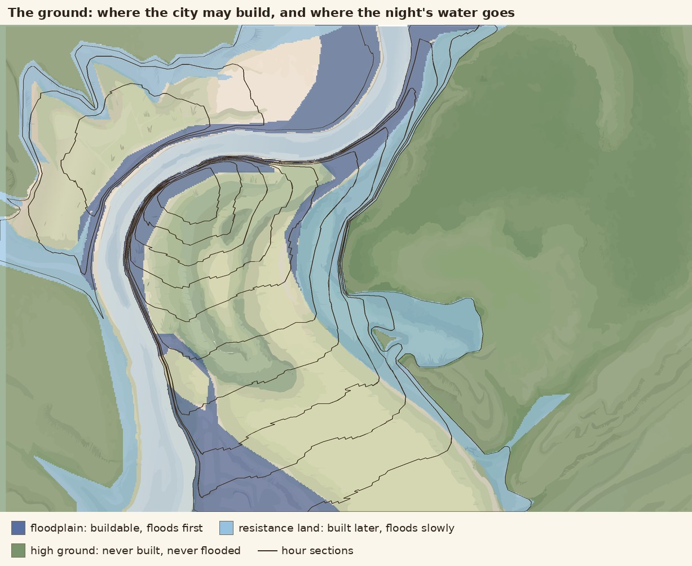

*The ground. Untinted land is free to build on.*

**What each section is given.** A character value *t* runs from 0 at 05:00 to 1 at 18:00, in steps of 1/13. It sets the targets each section is steered toward, from the organic-core column of the report (entropy 3.02, 11° off square, 11% dead ends, 28% crossroads) toward a planned column. The first four hours, *t* below 0.3, use the walker model. From *t* = 0.65 (14:00) a section counts as suburb.

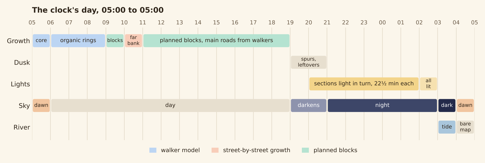

*The clock's day. Growth takes 14 hours; the rest of the cycle is dusk, lights, tide and dawn.*

## The walker core (05:00)

The 05:00 hour runs the round-2 prototype nearly as written: twelve five-minute stages of walking, trails into main streets, settling and lanes, with walls after stages 4 and 8. From minute 9, the clock's street-by-street growth also runs, to close loops (see *Infill* below). This part has not changed since Sep 28 except for the river trips and the market's square.

### Set-up, once per day

`organicSetup()` builds everything the walkers need before the first step:

- **The trail field.** A grid of 15 m cells covering the first four sections, holding G (worn ground) for equations 1–4. Cells in the river and on the market square are marked so no trail forms there.
- **The market** at the city centre, with 12 houses 40–70 m around it. Its edge (a 35 m octagon) is laid as the first street.
- **Three villages**, one in each of the 06:00, 07:00 and 08:00 rings, placed 25–70% of the way across the ring and at least 20 px from the river. Each gets 6 houses. They exist from the start, so walkers travel to them long before their section grows.
- **Gates**: five roads out of town at roughly even angles, 611 m out (0.47 of the prototype's 1.3 km), plus the bridge's near end. Later organic sections push the gates outward to their own edge.
- **The river's places**: four landings on the near bank, 170 m apart around the point nearest the market, and one destination 150–250 m beyond where the bridge will land.

*Stage 0: walkers between houses, market, villages and gates wear the first trails. Purple is worn ground G. (Sep 28 build; unchanged.)*

### Each stage

`organicStage()` repeats walker.py's loop, in its order:

1. **Link loose lanes** left over from the stage before (`connectLanes()`, below).
2. **Walk.** About 800 steps, more in bigger sections. 12% of trips run between the market and a landing and 5% between the market and the far-bank destination. The rest follow walker.py's mix: house → nearest market or village 50%, hub ↔ hub 10%, market ↔ gate 15%, house ↔ house (30–300 m apart) 25%. Each step applies the paper's equations with the prototype's fixes: unit destination pull, trail pull capped at 0.9, wear capped at G\_max, paved market. Walkers cannot enter the water: within 20 m of it they are pushed back, and within 10 m they can only slide along the bank.
3. **Trails into main streets** (`trailsToPlans()`). Cells worn past the street threshold, inside this section and its growth front, and not already a street, are thinned to one-cell lines, traced, and straightened. Pieces under 30 m with a loose end are dropped. An end that stops just short of a street is carried on to it.
4. **A wall**, after stages 4 and 8 (`buildWall()`): nine straight sides at random angles, 10 m beyond the growth front, each corner 0.9–1.1 × that radius. Any side that would touch the river is left out.
5. **Settle houses** (`settle()`): 60 per stage in the core, scaled by land in later rings. Each is placed 20–110 m from a worn cell or a street inside the growth front. Placement favours the front, the villages, and (outside the newest wall) the wall's gates.

*How a trail becomes a street: worn cells, thinned lines, straightened pieces. (Sep 28 build; unchanged.)*

### Between stages, every second

- **Lanes.** Queued houses get lanes one at a time, spread through the stage (`tryLane()`). A house more than 40 m from a street gets a straight lane from the nearest street point. The lane leaves near-square to that street (±6° wobble) and has a lognormal length (median 50 m). 90% of lanes run on until they meet a street, up to 200 m; 30% of those carry on across it to the next. A free end snaps to a street within 12 m. Lanes that would run alongside a street, or into the river or past the front, are cut or dropped.
- **Linking** (`connectLanes()`, at each stage's end). A lane that still ends in nothing carries straight on to the next street, or links to one within 40 m.
- **Planned streets grow** (`runPlans()`, `stepPlanned()`). Trails, walls and lanes are queued as plans and grown three at a time. Each grows straight, point to point. Wherever it crosses a street it makes a junction and carries on, so main streets and walls are never cut short.

### Infill

The walker model alone left 48–60% of the core never enclosed by streets, so the clock could not fill 60 blocks in the hour. From minute 9 (`WALK.infillAfter = 0.15`), the street-by-street spawner also runs in the core (`tickSecond()`). It adds short straight streets, near-square to existing ones, that must end on another street or at the section's edge. That closes the loops the lanes leave open.

*The core through its hour, streets coloured by origin. Houses are orange. (Sep 28 build; unchanged.)*

## Beyond the core

The walker model shapes the first four hours. From 09:00 the city is planned: walkers still choose the main roads, but the blocks are laid out by rule, and the rule gets stricter through the day.

### The organic rings, 06:00–08:00

These hours keep the walker's stages: walkers keep walking, trails keep becoming main streets, and houses keep settling and getting lanes. This is where the villages are absorbed. Walkers have travelled to them since 05:00, so the trails between village and market already exist when the ring's hour comes, and the ring grows along them. That matches the absorbed old villages the rings analysis found around real cores.

On its own the walker model left these rings only 4–14% built, because the prototype only ever grew a core. So the spawner runs here from the start, alongside the walkers. The walkers supply the main streets, villages and house lanes; the spawner fills in between.

*09:00: the core and the three organic rings. The walker's main streets are short pieces; infill does most of the enclosing.*

### The first hour across the river, 10:00

One hour still grows the way every hour after 09:00 did on Sep 28. The far bank starts at 10:00 from three footpaths at the bridge's far end (`seedFarBank()`). Each second the spawner tries to start one straight street: from a point on one of this hour's streets, from a street end left at the section's edge, or across a T-junction to make a crossroads. A new street must head for another street or the section's edge, and is tried out before it grows, so it never cuts off a sliver smaller than a block.

This hour is why the far bank has an old quarter of its own.

### The planned hours, 09:00 and 11:00–18:00

At the start of each of these hours the clock does three things in turn: it reads the grain of the city next door, lets walkers choose the hour's main roads, and plans the blocks.

**1. The grid follows the local grain.** The report's round 2 tried to give the core a grain by turning lanes toward the local street direction, and it failed. The clock uses a different idea for the planned hours only: continue the grain the old city has already formed. `grainAround()` takes every finished street within 60 px (270 m) of the section and builds a histogram of their directions modulo 90°, weighted by length, with main streets counting three times. It smooths the histogram over ±6° and takes the peak. A peak, not an average, is the point: an earlier version averaged the street directions of the last three sections, which blended the core's many directions into an axis that matched none of them.

*11:00: streets bordering the section (blue) vote on the grid's direction; the peak of their directions sets the axis (red). (Sep 28 build; the vote is unchanged.)*

**2. Walkers choose the main roads** (`dayWalk()`). The prototype's walkers stop at 09:00, and with them the reason trails converge. So the clock gives later hours somewhere to walk to:

- **Hubs** in the 09:00, 11:00, 13:00, 15:00 and 17:00 sections, placed as deep inside their section as possible. With the market at 05:00 and a village at 07:00, every odd hour has one.
- **Gates** at the edge of the day's city: on each bank, the farthest dry point in each of twelve compass sectors where the city reaches well out.

Each hour a coarse trail field over the whole city (28 m cells, rebuilt from the roads already there) is walked for 600 steps, from the city's exits to the hubs ahead on that bank and to the gates. Exits are the ends of main roads beside the section, or failing that the newest blocks. The best-worn trails across the section's open land are chained, straightened and turned toward the grain, more so later in the day (`snapTrail()`). At most two an hour, and twenty a day, become main roads. A trail that carries an existing main road on scores 2.5 times, and none is laid alongside another.

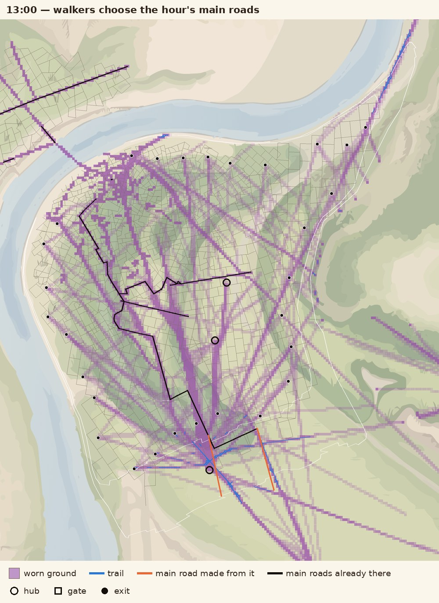

*13:00: walkers leave the built city for the hubs and gates. The two best-worn trails across the hour's land (outlined in white) become its main roads.*

All main roads belong to one network. It starts from the old city's main streets (walker trails and walls connected to the market) and the bridge (`seedNetwork()`). A new road that ends on an ordinary street promotes the streets from there to the network instead of driving through built blocks (`promoteToNetwork()`). From 09:00 a main road widens every two minutes, and a glowing tip travels its length.

**3. The blocks are planned cell by cell** (`planCuts()`). The section's land is divided into **patches**: wedges of equal land taken in turn round the place the section grows from. Each patch is a regular lattice with its own turn off the grain, its own block size and proportions, and its own pattern, bricks (T-junctions) early in the day and crossroads later. A main road that runs more than 8° off the grain gets a lattice of its own, three blocks deep on either side, so blocks front the road.

A lattice cell is a candidate if its middle is in the section, all of it is dry and off the high ground, and it does not sit on a block or a cell already there. A cell is built whole, so streets may cross the section's line by up to half a block. Cells are taken in a flood from those touching the city or a main road, and each gets all four sides, so blocks close one after another. Long streets are planned in pieces that stop at every junction, shared sides are drawn once, and nothing is drawn on top of an existing street. Where a street ends facing open land with another street within 1.2 block lengths, it carries on to it as a **link**. Planned streets grow at 15 px a second.

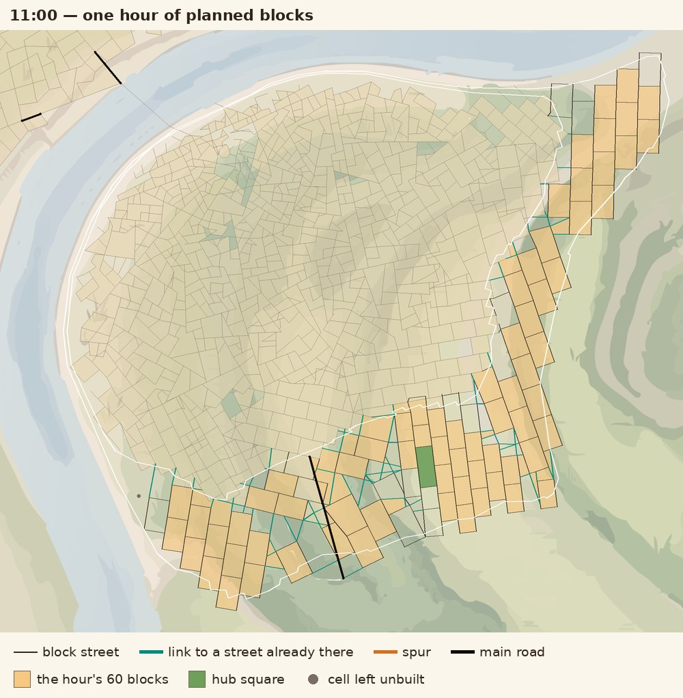

*11:00: one hour of planned blocks. Teal links tie the new blocks to the older city; the green cell is the hour's hub square.*

**Disorder is between patches, not between blocks.** Each place has an order from 0 to 1: the higher of how late in the day it is and how far it is from the market. Order sets how the patches differ:

- **How many.** A patch holds about 6 blocks at order 0 and 90 at order 1, so there are about eleven patches at 09:00, four or five at 11:00 and 12:00, and two from 14:00.
- **How far they turn.** Turns are spread evenly over ± 30° × (1 − order)^1.3 and dealt out at random. On one seed the blocks' turns had a standard deviation of 18° at 09:00, 10° at 12:00, 6° at 15:00 and 2° at 17:00.
- **How even they are inside.** Block-by-block wobble (uneven spacing, tilted cross streets) is at about half strength at 09:00 and gone by 11:00. After that the blocks inside a patch are identical.

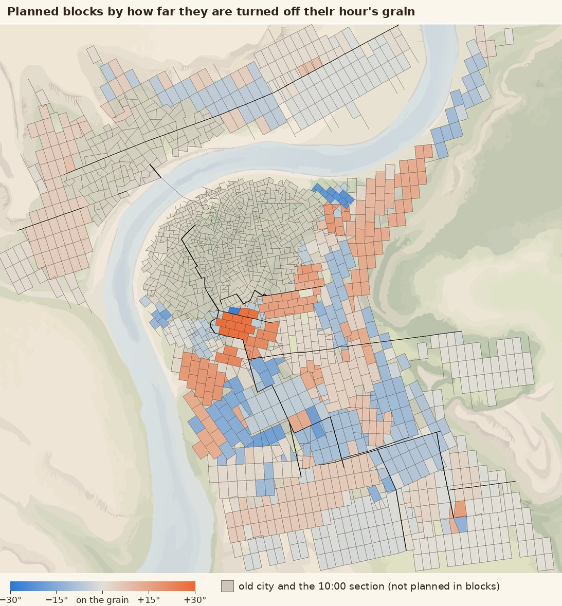

*The planned hours at 19:00, each block coloured by how far it is turned off its hour's grain. Patches are many and strongly turned beside the old city, few and nearly on the grain at the edge.*

**The suburbs thin out by leaving cells unbuilt, not by fading.** In city sections every candidate cell is built. In suburb sections the share falls to 65% at 18:00, never fewer than 76 cells, so each hour can still hold its 60 blocks. The cells that are built favour the main roads, in ribbons two strips deep with the third left open. Within about 360 m of open land, which cells are built is partly chance, which gives a ragged edge. Beside an unbuilt edge cell a street may carry on one block as a dead-end **spur**.

### The river

- **River ends.** A street reaching the bank stops short of the water. About half of those ends may be joined by a riverside street.
- **Water lanes** (`waterLanes()`). Every five minutes in a planned hour that touches the river, short lanes run from the water's edge inland to the first street.
- **The embankment** (`buildEmbankment()`). One minute into dusk, a street is laid at the water's edge along each built-up stretch of bank, joining the street ends that reached the river.

### Seams and loose ends

Every organic hour, and 10:00, used to leave a ragged edge. Streets that grew to their section's edge stopped there, waiting for the next hour to carry them on, and almost nothing did: the walker model and the block plan both ignore them. Each of those hours left 55–80 stubs. The ground between the stubs was open when the hour ended, so no block could take it; the next hour's streets closed it off, and it stayed unshaded until dusk.

Two rules now tidy this up as the city grows:

- **Loose ends** (`tidyStubs()`, every five minutes and at each hour's end). A street end with nothing beyond it is carried straight on to the next street, if that is within 1.5 block sides and the way does not cross water, high ground or one of an hour's blocks. One that cannot be carried on by the end of the hour is removed, back to the last junction. An end is left alone while the ground ahead belongs to a section due within two hours, so those hours can still pick it up. Main roads are carried on (up to 3.75 block sides) but never removed. Walls, river ends and the suburbs' spurs are left as they are.
- **Seams** (`fillSeams()`, every minute). An enclosed area inside a finished section that is still unshaded is shaded in the plain paper tone as soon as it closes. It is not one of any hour's 60 blocks. In suburb sections only scraps under 0.6 of a block are taken, so their empty lots stay open.

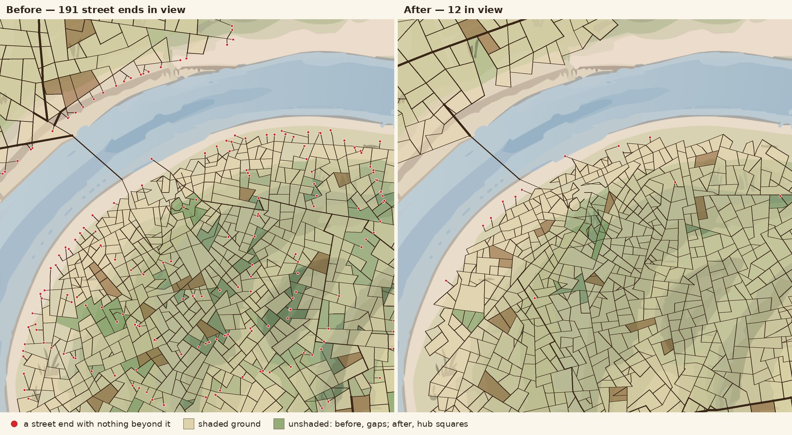

*12:36, same seed, before and after. The dots are street ends with nothing beyond them; the darker green patches on the left are enclosed ground nobody shaded.*

Measured at 19:00 on seven seeds: 26–43 dead ends a city, against 305–340 before; 23–45 enclosed areas left unshaded (the seven hub squares among them), against about 230. Of the dead ends that remain, 11–26 are the suburbs' spurs, which are deliberate.

### The order gradient

The design aim is that disorder falls in a straight line through the day. It is measured two ways on each hour's streets: entropy of street angle (36 bins of 10°, weighted by length, as in the report) and entropy of street length (half-octave bins, by count).

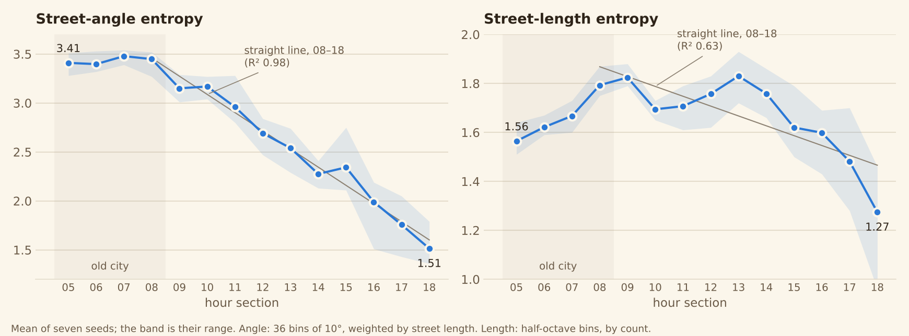

*Angle and length entropy of each hour's streets, mean of seven seeds.*

Angle entropy does what was asked: from 3.45 at 08:00 to 1.51 at 18:00, within 0.18 of a straight line (R² 0.98). The largest gap is at 15:00, the second hour on the far bank. Length entropy does not. It stays between 1.7 and 1.8 until 13:00 and only then falls (R² 0.63). Once blocks are regular an hour's streets come in two lengths, a block's width and its length, plus links of every length, and that scores about the same as the old city's single broad spread.

## Blocks and time

The hour is the number of finished sections plus five; the minute is the number of shaded blocks in the growing section. Everything below exists to keep that count honest and easy to read.

**Each hour's share.** Each section's 60 blocks should cover 85% of its land between them, so each block's share is 1/60 of that. After the 13:00 peak the share stays at the peak's size, however much land the section has, which is what leaves the suburbs open. Street spacing is set a little finer than the share (60%), so there are enough enclosed areas to choose from.

**One block a minute** (`tickMinute()`, `fillBlock()`). On each minute, blocks are filled until the count equals the minute, up to six at once to catch up. The chosen enclosed area is scored for size, compactness, bordering finished streets, and nearness to where growth started. It may then take in neighbouring empty areas up to about its share. In a planned hour this merging is paced: the hour knows how many cells it planned, and shares the spare ones out among its blocks so the section fills evenly. When the count is more than two behind, or in the last ten minutes, any compact shape is accepted. The hour's last block also takes every compact enclosed area still empty in the section.

If a minute comes with nothing left to fill, an earlier block that took in extra areas gives one up, and that becomes the minute's block (`splitOffBlock()`). The count stays right but nothing new is shaded, so these are kept rare.

**Reading the time.** Three marks, all drawn from the simulation's own state:

- **The growing hour is warm.** Its blocks are amber until the hour ends, then cool to the paper tone over two minutes. The amber area is the current hour; counting it gives the minute.
- **Every 15th block is darker** (`countBlock()`). The 15th, 30th and 45th block of each hour are burnt orange while the hour grows and brown afterwards. The minute is the last quarter mark plus the amber blocks after it.
- **Every odd hour leaves a green square.** The enclosed area holding the hour's hub is never shaded (`squareFace()`, `inSquare()`). In a planned hour it is the hub's own cell, stretched by 0.22 of a block at each end, so about 1.4 blocks. In the old city it is the area holding the market or village if that is 1.2–2.2 blocks in size, otherwise the nearest empty area of that size within 90 px (`ensureSquare()`). Seven squares mean the day has passed 17:00. They carry no outline or mark, only a soft green tint so they read as green on sandy ground too.

*The 11:00 section filling. Amber is the hour being built, burnt orange its quarter blocks. The long green cell among them is the 11:00 hub square.*

**Keeping growth visible to the end.** Three things spread motion through the hour:

- **Pacing.** Each section gets a street-length budget of 4 × land ÷ block side. It starts with 8 minutes' worth, then refills at 1.4× the average rate, easing to 0.6× by the end. New trails, lanes and spawned streets all spend it.
- **Widening.** From 09:00 a main road widens every 2 minutes. On screen a glowing tip travels its length over 9 seconds.
- **Glowing tips.** Each street takes 6 seconds to grow and shows an amber tip while it does.

This works in the organic rings and at 10:00, where about two thirds of the hour's street length is drawn in the first ten minutes and the rest arrives through the hour (the core starts slower: 15% in ten minutes, two thirds in twenty). It does not yet work in the planned hours: there the streets are finished by minute 20, and for the remaining 40 minutes only blocks, widening roads and the odd joined street end move.

**How exact it is.** On seven seeds all 98 hours closed at exactly 60 blocks. From 06:00 to 18:00 the count matched the minute except for 0–3 minutes of an hour, and was never more than 2 behind. The 05:00 core runs up to 9 behind in its first ten minutes, while the first trails form, and has 1–6 minutes whose block is not visibly new; three seeds had one or two such minutes in a later organic ring. Sections end 83–96% shaded from 05:00 to 12:00, falling to 47–56% at 17:00 and 18:00.

## The camera

The camera frames the city as it stands: the bounding box of every street built so far and the ones being drawn, with a 10% margin that is clipped at the map's edge (`cityExtent()`, `framing()`). It widens when streets reach new ground, most visibly when the bridge lands at 10:00, and eases toward its target rather than jumping. Once the city reaches the map's edges it shows the whole map.

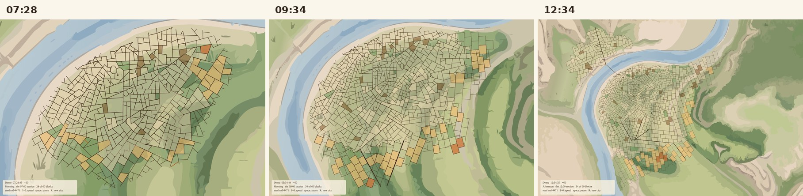

*The same day at 07:28, 09:34 and 12:34: the view widens with the city. The label at the bottom left gives the time, the section and the block count.*

## Evening and night

After 19:00 nothing more is counted, but the map keeps moving until the next city starts at 05:00.

**Dusk, 19:00–21:00.** A dark-blue overlay fades in. Every 15 seconds a street at the city's edge is pushed out one more block into open country (`extendOutward()`), every 20 seconds a leftover enclosed area is shaded (`fillLeftover()`), and the embankment is laid. With seams now shaded during the day, dusk finds about half as much to fill as it did (45–64 areas, was 95–112).

**The lights, 20:00–02:00.** Every street becomes a line of small warm dots (`buildLightEvents()`). The night goes through the day's hours in order, 22½ minutes to each, and the streets round a filled block brighten once all of them are lit. Within an hour the lights no longer retrace the order of building. They start at one junction and spread outward along the streets:

- at the section's **hub**, if it has one (every odd hour);
- otherwise on the section's **main road**, at the junction nearest where the previous hour's lights were thickest. If that hour was across the river, the hour before it is used instead.

Light travels 3.5 times faster along a main road than a side street, so the roads light first and the streets fill in off them. Where these rules come from, and how closely the result follows them, is the subject of the next section.

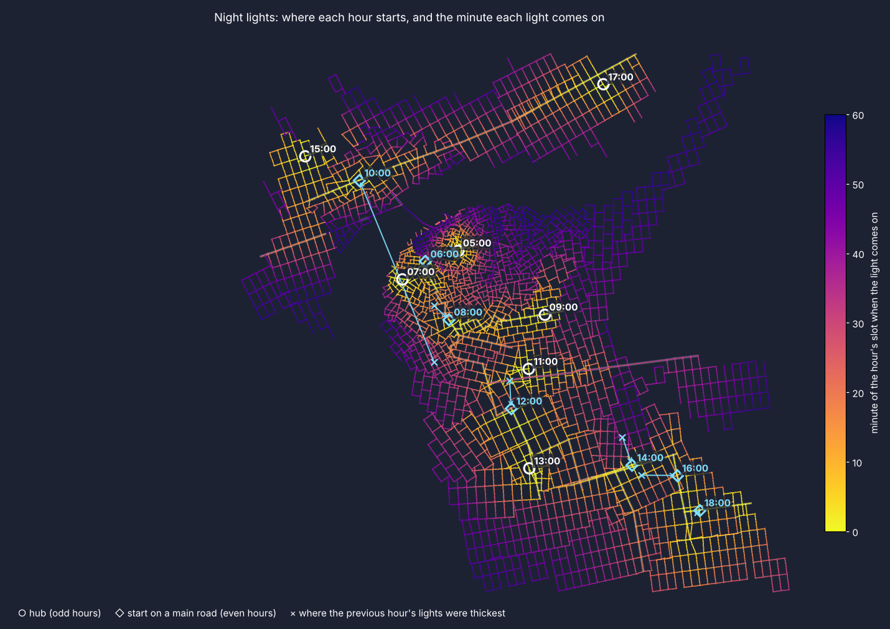

*The order of the lights. Each hour starts at its hub (circle) or on a main road (diamond) and spreads; yellow lights come on first, purple last.*

**The tide, 03:00–04:00.** The river rises in alternating bands of its two blues, following its own shape: fastest over the floodplain, then free land, slowly into resistance land, never onto high ground (`drawTide()`). The lights go out under it.

**Dawn, 04:00–06:00.** The old city is gone. The overlay turns from blue to orange, the new city starts at 05:00, and the orange lifts through its first hour.

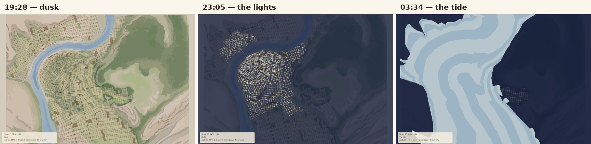

*Dusk, the lights partway through the day, and the tide. (The first two are one seed, the third another.)*

## The lights as a network rollout

The light-up rules were written from a companion note, *How Cities Adopt Networked Infrastructure* (Oct 6, 2026), which traces how gas, electricity and broadband each spread through a city. This section sets the clock's lights against that note.

**What the note found.** All three networks reached a city in the same order: a public or institutional anchor first (street lamps, transit, universities), then commercial premises along the first lines, then affluent households near those lines, then ordinary households once pricing changed, and last the low-density and low-income areas, by mandate or subsidy. The spatial rule, stated by Platt for Chicago, is that each network was planted at the centre, where density and wealth were greatest, and grew outward (1991, p. 25). Two things shaped the map: the lines ran along streets already there, and a distance limit, about half a mile for an early power station, kept each source inside the district it served.

**How the rules translate it.** A hub stands for the anchor, a main road for the first line with its commerce and transit, the side streets for the households behind it. Each hour's section is a district with one source. The day's order of building stands in for centre-outward.

**How closely the result follows.** Measured on two seeds, every light in the city, by when it comes on (`tests/lightstats.js`, `tests/lightstats.py`):

| What the note found | What the lights do | Fit |
| --- | --- | --- |
| An anchor comes before homes | In an odd hour the lights start at the hub's square. Lights within 100 m of a section's start are on within the first 2–4 minutes of the hour being replayed | Yes for odd hours. Even hours have no anchor and start on a main road |
| Lines ride an existing right-of-way | Light travels only along streets, and a light's turn depends on its distance by street from the start | Yes |
| Commerce and transit along the first lines, homes behind them | Light runs 3.5 times faster on a main road. A sixth of the way through an hour, 56% of its main-road lights are on and 16% of its side-street lights | Yes, inside each section |
| Planted at the centre, grown outward | Sections light in the order they were built. Time of night against distance from the market has a rank correlation of 0.97 on the near bank, and 0.87–0.89 from the bridge on the far bank | Yes |
| Near the line before far from it | Within a section, the rank correlation between when a light comes on and its distance from the start has a median of about 0.95 | Yes |
| New plant goes where load already is, and reuses the network | An even hour starts on its main road at the junction nearest where the previous hour's lights were thickest, with brightened streets counting for more. Eleven times in fourteen that junction touches a street already lit | Yes, loosely |
| Scattered islands, joined up later | A hub hour starts inside its own section, 70 m to 1.3 km from the nearest lit street, and meets the lit city as it spreads | Yes |
| A distance limit keeps each source local | One source per hour section, but no limit on its reach: 58–61% of lights are more than half a mile from their start, and the farthest about 6.5 km, because a section wraps round the city | Partly |
| Revenue per length of line sets the order; no mains unless a whole block would connect | Density sets brightness, not order. The streets round a shaded block brighten once all of them are lit (83% of lights). Streets with built ground on both sides light only 1–4 minutes of the replayed hour ahead of streets with none, and that is a side effect of where they lie | Partly |
| Lines everywhere before homes anywhere | Each section finishes before the next begins, so the old city's back lanes are lit long before the 13:00 main road | No |
| Homes fill in slowly, then fast | The lights come on at an even pace through each hour's slot | No |
| The last users need a separate device, and may never be reached | Everything is lit by 02:00. The suburbs are last (23:23–01:14), then dusk's spurs, but nobody is left dark | No |

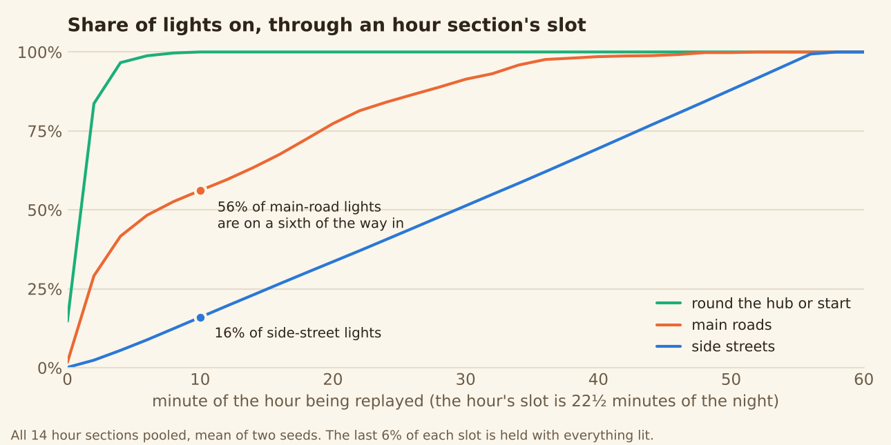

*Round the start the lights are on almost at once; main roads run well ahead of side streets, which come on at an even pace.*

**So: roughly, yes.** The lights follow the note's spatial logic. They start at an anchor, run out along the main lines, fill in behind them, and move from the centre to the edge, with the old city lit by 21:29, the middle of the day by 23:21 and the suburbs after that. What they leave out is the note's social half: who pays, who waits, and who is never reached. The night has no rich and poor blocks, no pause before homes are worth serving, and no district left dark.

The three "no" rows come from one choice, made on purpose: the night still goes through the day's hours one at a time, at an even pace, so the lights can be read as a replay of the day. A closer fit to the note would cost some of that. The changes that would do most, none of them built:

- **Let lines run ahead of homes.** Light each hour's main roads during the hour before, so a lit road reaches into dark ground before the streets round it come on.
- **Give sources a reach.** Where light would have to travel more than half a mile, start a second source on the nearest lit street, as substations went where load already was.
- **Let density set the order.** Count a street beside shaded blocks as shorter, so built-up streets light before empty ones at the same distance.
- **Leave the last step undone.** Hold the suburbs' unbuilt streets dim, or dark, until 02:00.

## Saving and replaying

The city is fully determined by its seed. In clock mode the seed is the date, so every refresh on the same day rebuilds the same city, and the page saves the city every 15 minutes of city time so a reload carries on from the save. Without a save it replays the day from 05:00 behind a loading screen. Demo mode (`?mode=demo&speed=60&seed=…&start=12.5`) runs any seed at any speed from any hour.

A save holds every street, block, plan and square, and the walkers' worn ground: about 2.3 MB by evening. Anything rebuilt after a restore, such as the hourly trail field, depends only on the map and the seed, so a restored city continues exactly as an unbroken one would.

## Departures from walker.py

The equations and the round-2 rules are unchanged; what changed is resolution, timing and the jobs the prototype never had to do.

| Aspect | walker.py | City clock | Why |
| --- | --- | --- | --- |
| Site | 1.3–1.6 km square, open ground | Vector base map at 4.5 m/px, with a river, a far bank and zoned ground | The clock's map |
| Trail field | 5 m cells; exp(−r/σ) kernel by FFT convolution every 4 steps | 15 m cells; three box blurs of about 0.9σ approximate the kernel, gradient every 8 steps, regrowth applied every 8 steps | Speed in the browser, which must also replay a whole day on load |
| Growth front | Linear over 12 stages to 0.45 L | Linear, reaching the section's edge by stage 9 | Each hour must end built out |
| Houses per stage | 25 (the default in code) | 60 in the core, scaled by land in later rings | Enough lanes to close 60 blocks in an hour |
| Trail straightening | Douglas–Peucker at 6 m (12 m when settling) | At 12 m or 1.2 cells, whichever is larger | Coarser cells |
| Villages | 3, at 0.28–0.40 L from the centre | 1 in each of the 06:00, 07:00 and 08:00 rings | Villages are absorbed hour by hour |
| Gates | 5, fixed at 0.47 L | 5 roads plus the bridge; pushed out to each organic section's edge | The city outgrows the prototype's area |
| Trips | House, hub and gate trips | The same, plus 12% to river landings and 5% to a far-bank destination | The river |
| Walls | After stages 4 and 8 | The same, in the core only; sides touching the river dropped | The river |
| Adding streets | Whole segments at once | Grown straight at 15 px/s, junctions made where they cross, paced by a length budget | Animation, and visible growth through the hour |
| Lanes | From the nearest street | The same, but may start on an earlier hour's street; clipped to the section and the river | Hourly sections |
| Filling gaps | None (scored by windows) | Street-by-street infill from minute 9 in the core, all hour in the rings | 48–60% of the core was never enclosed |
| After the core | Not modelled | A second, coarse walk each hour (28 m cells, 600 steps) to hubs and gates; its best trails become main roads | Trails need destinations to keep converging |
| Loose ends | Left as they fall (24% dead ends) | Carried on to the next street or removed once the ground ahead is built | Hundreds of stubs at section edges |
| Blocks | Not modelled | 60 per hour, each taking in small neighbours to reach its share | Telling the time |

The prototype's round-2 grain rule, turning lanes toward the local street direction, is not used in the core. Its only descendant is the planned hours' grid, which takes its direction from the old city beside it.

## How close it gets

The clock's core reads as a walled old town, but by the report's measures it is further from a real organic core than round 2 was: the price of 60 blocks in its hour. Measured on the 05:00 section, three seeds, with the report's definitions (`tests/core_measures.js`):

| Measure | Organic target | Round 2 prototype | Clock core, Sep 28 | Clock core now, at 06:00 | Now, at 07:00 |
| --- | --- | --- | --- | --- | --- |
| Junctions per km² | 119 | 120 | 437–447 | 449–464 | 477–496 |
| Dead-end share | 11% | 24% | 1–2% (see note) | 13–14% | 0–1% |
| Orientation entropy | 3.02 | 3.32 | 3.36–3.50 | 3.41–3.49 | 3.43–3.50 |
| Off-square (°) | 11.0 | 15.9 | 16.7–19.5 | 17.3–21.1 | 18.7–25.2 |
| Crossroads share | 28% | 28% | 38–41% | 35–41% | 35–38% |
| Circuity | 1.07 | 1.09 | 1.00 | 1.00 | 1.00 |
| Median segment (m) | 74 | — | 41–42 | 39–40 | 38–40 |

**A note on dead ends.** The Sep 28 figure of 1–2% left out street ends at the section's edge. Counting them in the Oct 5 build, the nearest one still to hand, the core had 16% dead ends at 06:00 and 10% at 07:00 (one seed). The current build has 13–14% at 06:00, all of them at the edge waiting for the 06:00 ring, and almost none an hour later, once they have been carried on or removed. So the core passes through the organic target of 11% and ends well below it.

Carrying street ends on also makes the core a little denser and its junctions less square: each carried-on end meets the next street at whatever angle it arrives.

The walker's streets are a minority of the result. In the core at 06:00, walker trails are 16–21% of the street length, walls and the market's edge 7–9%, and house lanes 3–5%. The other 69–72% is infill. By 19:00 the city has 510–520 km of streets: 68–70% planned block streets and their links, 23–24% street-by-street growth (the old city's infill and the 10:00 section), 3% main roads, 1% carried-on ends, and 2.5–3% streets from the walker model.

*The finished city at 19:00, streets by origin: the walker's main streets and walls are concentrated in the core.*

**Known weaknesses**

- **Too dense.** 60 blocks in the core's 0.63 km² needs about four times the organic junction density. The only fixes are a bigger 05:00 section or fewer blocks in that hour.
- **Too few dead ends, now by choice.** Real cores have 11%; the finished clock core has almost none, because loose ends are carried on or removed.
- **Too little grain in the core.** The report's weakness remains: entropy stays above 3.4 where real cores have 3.02.
- **Broken main streets in the core.** Diagonal trails trace as staircases on the 15 m grid, so they straighten into chains of short pieces, not one long street. The rings figure shows it. After 09:00 the main roads are long and straight.
- **Perfectly straight streets.** Circuity is exactly 1.00 because every street is one straight segment, a rule of the clock rather than a finding.
- **Planned hours finish their streets early.** By minute 20 of a planned hour every street is drawn.
- **Length entropy is not on a line.** It holds level until 13:00 before it falls.
- **The suburbs are limited by the map.** The last two hours are about half shaded. A third of their cells touch the river, the high ground or the map's edge and cannot be built whole, and the near bank has no buildable land left.
- **Some main roads stop short.** Four to eleven a day end without meeting a street, where carrying them on would cut through a block.
- **The squares are quiet.** In the suburbs a hub's square looks like any other empty lot.
- **Slow first load.** Replaying a full day takes about 70 seconds in Node and 85 in the browser; saves make reloads quick.

## Code map

The walker model lives in section 5 of `sim.js`; everything else calls into it or runs after it.

| File | Part | What it does |
| --- | --- | --- |
| `sim.js` | `WALK`, `LANE` | The walker and lane settings, in metres (κ, λ, σ, stages, villages, walls, lane rule, river) |
| `sim.js` | `TrailField` | The trail field G: `run()` walks (equations 1–4), `gradient()` approximates ∇V, `trailMask()` finds street-worthy cells |
| `sim.js` | `skeletonLines()` | Thins worn cells to one-cell lines and traces them into polylines |
| `sim.js` | `organicSetup()`, `organicStart()` | Market, houses, villages, gates, landings and the day's hubs once a day; each organic section's start |
| `sim.js` | `organicStage()`, `organicTick()` | One stage (link, walk, trails, wall, settle); per-second lanes and planned streets |
| `sim.js` | `trip()`, `settle()`, `buildWall()` | walker.py's trip mix, house settling and walls |
| `sim.js` | `tryLane()`, `connectLanes()` | The lane rule and end-of-stage linking |
| `sim.js` | `addPlan()`, `runPlans()`, `stepPlanned()` | Planned streets grown straight, with junctions where they cross |
| `sim.js` | `tickSecond()`, `tryStart()`, `spawnIsLegal()` | Street-by-street growth: infill in the organic hours, all growth at 10:00 |
| `sim.js` | `grainAround()`, `align()` | The grid direction from bordering streets, and the pull toward it |
| `sim.js` | `dayWalk()`, `snapTrail()` | The hourly walk to hubs and gates; trails into main roads |
| `sim.js` | `seedNetwork()`, `promoteToNetwork()`, `joinMainRoads()`, `thoroughfares()` | One main-road network, carried on from hour to hour |
| `sim.js` | `planCuts()` | Patches, candidate cells, which cells are built, their streets, links and spurs |
| `sim.js` | `tickMinute()`, `fillBlock()`, `splitOffBlock()`, `countBlock()` | One block per minute, merging neighbours to its share; quarter marks |
| `sim.js` | `squareFace()`, `openSquare()`, `ensureSquare()`, `inSquare()` | The hub squares |
| `sim.js` | `tidyStubs()`, `fillSeams()` | Loose street ends carried on or removed; closed-off ground shaded |
| `sim.js` | `waterLanes()`, `buildEmbankment()`, `buildBridge()`, `seedFarBank()` | The river and the far bank |
| `sim.js` | `tickDusk()`, `extendOutward()`, `fillLeftover()` | Dusk |
| `sim.js` | `enterStage()` | Each hour's section: character t, block share, street spacing, pacing budget |
| `sim.js` | `snapshot()`, `restore()` | Saving and restoring a city |
| `geometry.js`, `zones.js` | `SECTIONS`, `HOURS`, `ZONES` | The 14 hourly sections and the ground (made by `tools/hourly_zones.py` and `tools/gen_zones.py`) |
| `sketch.js` | `DAY` | The day's timetable |
| `sketch.js` | `drawLiveCity()`, `drawFrozen()`, `drawSnap()` | Blocks in their tones, squares, glowing tips, road widening |
| `sketch.js` | `cityExtent()`, `framing()` | The camera |
| `sketch.js` | `buildLightEvents()`, `drawLights()`, `drawTide()` | The night: where each hour's lights start, how they spread, and the tide |
| `sketch.js` | `drawHud()`, `maybeSave()` | The label and the saves |

Settings worth trying first:

- **The core:** `WALK.infillAfter` (when infill joins the core), `WALK.wallsAt` (empty for no walls), `WALK.villages`.
- **Blocks:** `CFG.COVER` and `CFG.FACE_SHARE` (how much each hour's blocks cover, and how fine the streets are), `CFG.PACE` (how evenly growth spreads through the hour).
- **Planned hours:** `CFG.PATCH_BLOCKS` and `CFG.PATCH_TURN` (how many patches, and how far they turn), `CFG.BLOCK_JITTER_UNTIL` (when blocks inside a patch become identical), `CFG.CUT_SUBURB_KEEP` and `CFG.EDGE_SPURS` (how open the suburbs are, and how many spurs), `DAYWALK.hubs`, `CFG.MAIN_ROADS_PER_HOUR`.
- **Tidying:** `CFG.STUB_REACH` (how far a loose end may be carried), `CFG.SEAM_SUBURB` (how much closed-off suburb ground is shaded), `CFG.SQUARE_GROW` (how much larger a square is than its neighbours).
- **Looks:** `BLOCK_NOW`, `BLOCK_QUARTER`, `GREEN` and `NOW_FADE` in `sketch.js` (the time marks), `CAM_MARGIN`, `LIGHT_ROAD_SPEED`.
