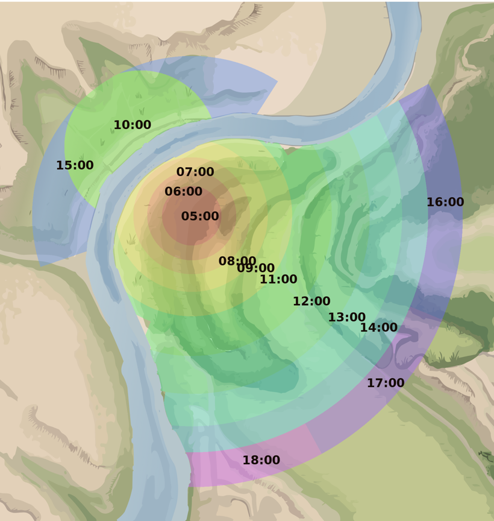
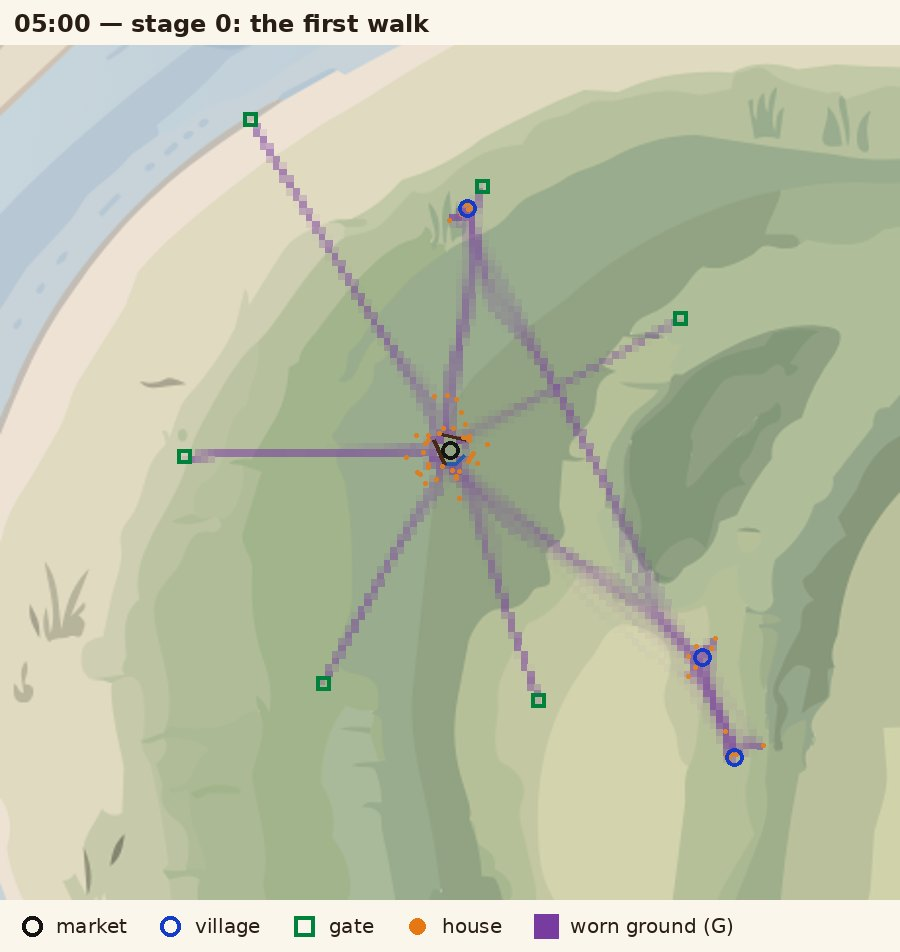
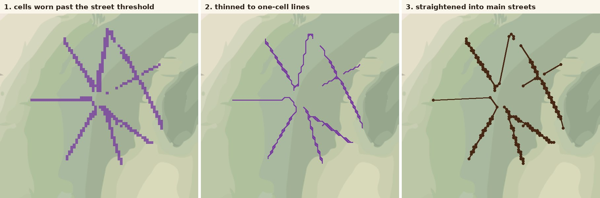
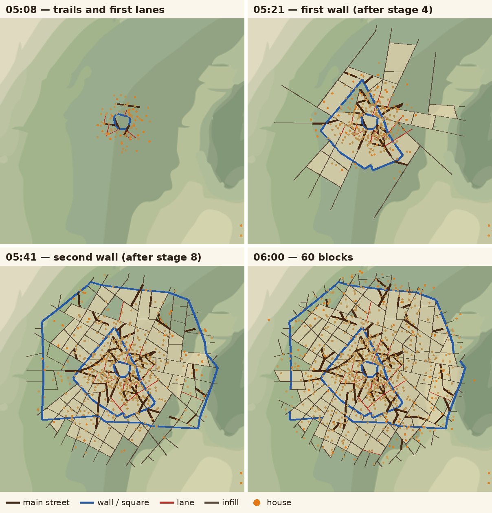
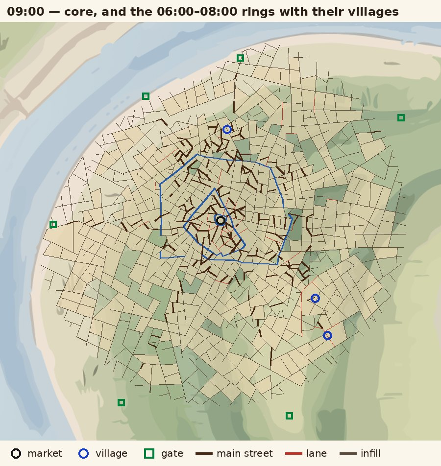
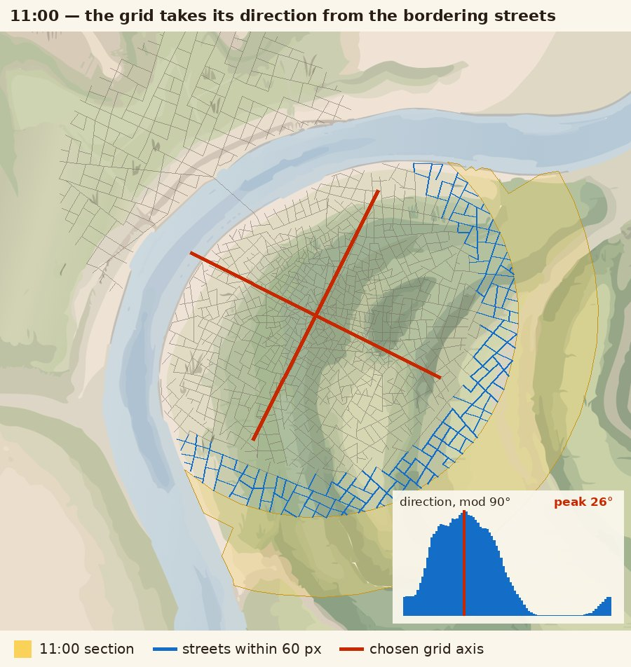
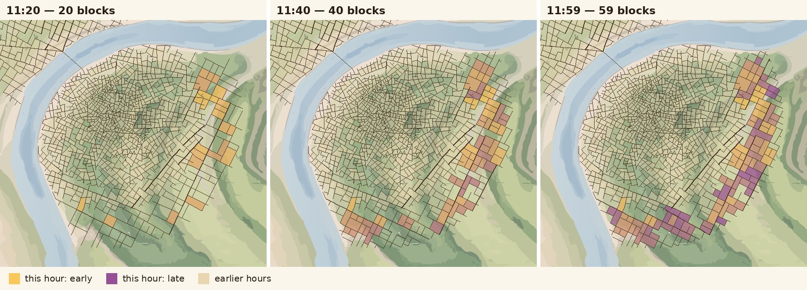
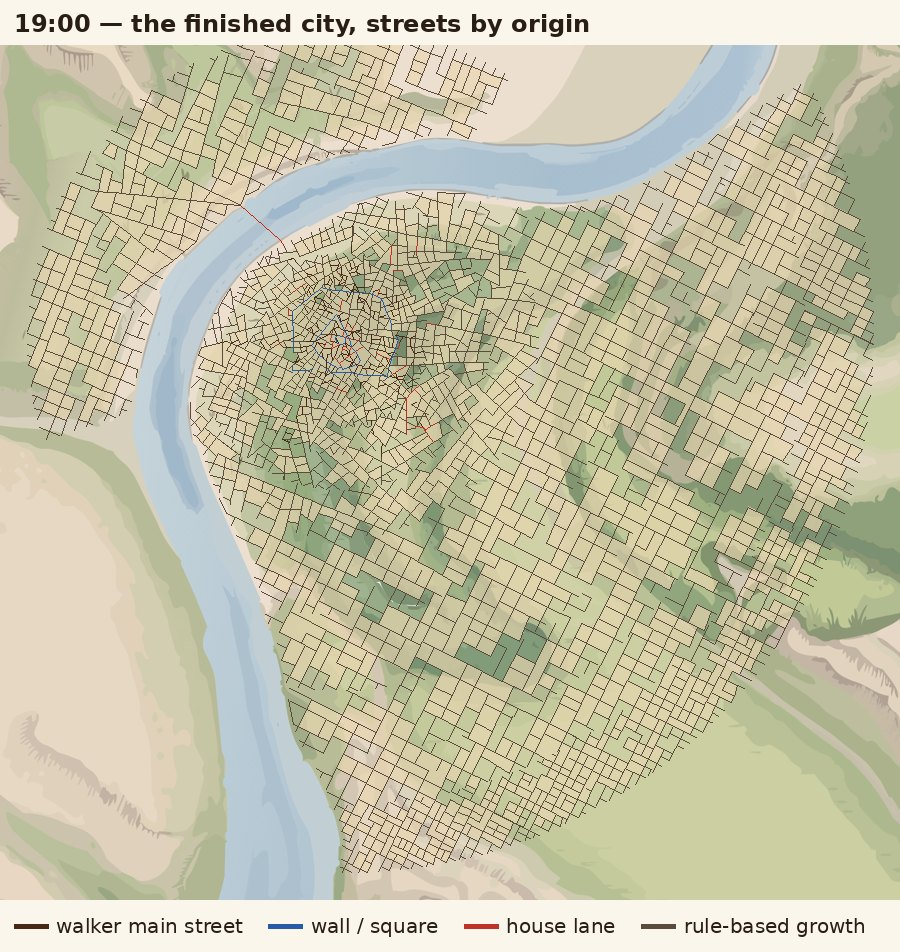

# How the City Clock Uses the Walker Model

*Sep 28, 2026 · AC*

## Overview

The city clock runs a port of `walker.py` (the Stage 3 prototype) as its first hour, then hands growth to rule-based growth for the rest of the day. This document explains that hand-over. It complements *Street Networks of Organic City Cores — Research Process*, which covers how the walker model was built and scored; here the question is what the clock does with it.

The clock adds three things the prototype never had to handle:

- **A clock face.** One section of the map per hour from 05:00 to 19:00, 60 blocks per section, one block per minute, so the time can be read off the map.
- **A real site.** A river, a bridge and a far bank, drawn on a vector base map.
- **A whole city.** The prototype grew one old core; the clock grows the core, then organic rings with absorbed villages, then planned districts whose grid follows the local grain.

The code lives in three files: `sim.js` (growth), `sketch.js` (the clock, camera and drawing, in p5.js) and `geometry.js` (the map's sections, river and bridge). Section and function names below refer to those files.

## From prototype to clock

The clock fits the prototype into a map by fixing a scale, and into a day by giving each hour its own section of land.

**Scale: 4.5 m per map pixel.** At this scale the first section, 05:00, has a radius of about 99 px, or 445 m. That is close to the prototype's whole grown core (0.45 × 1.3 km = 585 m). Its 60 blocks then land near the organic target of about 119 junctions per km². At the 3 m per pixel used earlier in the project, the same 60 blocks would have been more than twice as dense. The walker's parameters are kept in metres (`WALK`, `LANE` in `sim.js`) and converted with `CFG.M_PER_PX`.

**Time: one section per hour, 05:00 to 19:00.** Each hour grows one section. The day's S-curve (a 20% steady rate plus a logistic, steepest at 13:00) sets each section's land area, not the speed of the clock. The 05:00 core holds 31k px²; 12:00 and 13:00 hold 152k px² each; 18:00 holds 49k px². Most hours are rings around the centre. The far bank is two sections, 10:00 and 15:00, measured from where the bridge lands; the bridge itself is built in the last minute of 09:00. The last three hours are wedges of the outer band, because as rings they would be too thin to hold 60 blocks.

*The 14 hourly sections on the base map. Colours only separate neighbouring sections.*

**What each section is given.** A character value *t* runs from 0 at 05:00 to 1 at 18:00. It sets the targets each section is steered toward, from the organic-core column of the report (entropy 3.02, 11° off square, 11% dead ends, 28% crossroads) toward a planned column. Only the first four hours, *t* below 0.3, use the walker model.

## The walker core (05:00)

The 05:00 hour runs the round-2 prototype nearly as written: twelve five-minute stages of walking, trails into main streets, settling and lanes, with walls after stages 4 and 8. From minute 9, the clock's rule-based growth also runs, to close loops (see *Infill* below).

### Set-up, once per day

`organicSetup()` builds everything the walkers need before the first step:

- **The trail field.** A grid of 15 m cells covering the first four sections, holding G (worn ground) for equations 1–4. Cells in the river and on the market square are marked so no trail forms there.
- **The market** at the city centre, with 12 houses 40–70 m around it. Its edge (a 35 m octagon) is laid as the first street.
- **Three villages**, one in each of the 06:00, 07:00 and 08:00 rings, placed 25–70% of the way across the ring and at least 20 px from the river. Each gets 6 houses. They exist from the start, so walkers travel to them long before their section grows.
- **Gates**: five roads out of town at roughly even angles, 611 m out (0.47 of the prototype's 1.3 km), plus the bridge's near end. Later organic sections push the gates outward to their own edge.

*Stage 0: walkers between houses, market, villages and gates wear the first trails. Purple is worn ground G.*

### Each stage

`organicStage()` repeats walker.py's loop, in its order:

1. **Link loose lanes** left over from the stage before (`connectLanes()`, below).
2. **Walk.** About 800 steps, more in bigger sections. Trips follow walker.py's mix: house → nearest market or village 50%, hub ↔ hub 10%, market ↔ gate 15%, house ↔ house (30–300 m apart) 25%. Each step applies the paper's equations with the prototype's fixes: unit destination pull, trail pull capped at 0.9, wear capped at G\_max, paved market.
3. **Trails into main streets** (`trailsToPlans()`). Cells worn past the street threshold, inside this section and its growth front, and not already a street, are thinned to one-cell lines, traced, and straightened. Pieces under 30 m with a loose end are dropped. An end that stops just short of a street is carried on to it.
4. **A wall**, after stages 4 and 8 (`buildWall()`): nine straight sides at random angles, 10 m beyond the growth front, each corner 0.9–1.1 × that radius. Any side that would touch the river is left out.
5. **Settle houses** (`settle()`): 60 per stage in the core, scaled by land in later rings. Each is placed 20–110 m from a worn cell or a street inside the growth front. Placement favours the front, the villages, and (outside the newest wall) the wall's gates.

*How a trail becomes a street: worn cells, thinned lines, straightened pieces.*

### Between stages, every second

- **Lanes.** Queued houses get lanes one at a time, spread through the stage (`tryLane()`). A house more than 40 m from a street gets a straight lane from the nearest street point. The lane leaves near-square to that street (±6° wobble) and has a lognormal length (median 50 m). 90% of lanes run on until they meet a street, up to 200 m; 30% of those carry on across it to the next. A free end snaps to a street within 12 m. Lanes that would run alongside a street, or into the river or past the front, are cut or dropped.
- **Linking** (`connectLanes()`, at each stage's end). A lane that still ends in nothing carries straight on to the next street, or links to one within 40 m.
- **Planned streets grow** (`runPlans()`, `stepPlanned()`). Trails, walls and lanes are queued as plans and grown three at a time. Each grows straight, point to point. Wherever it crosses a street it makes a junction and carries on, so main streets and walls are never cut short.

### Infill

The walker model alone left 48–60% of the core never enclosed by streets, so the clock could not fill 60 blocks in the hour. From minute 9 (`WALK.infillAfter = 0.15`), the rule-based spawner also runs in the core. It adds short straight streets, near-square to existing ones, that must end on another street. That closes the loops the lanes leave open.

*The core through its hour, streets coloured by origin. Houses are orange.*

## Beyond the core

The walker model shapes the first four hours; from 09:00 the city grows by rules, with a grid whose direction is taken from the old city beside it.

### The organic rings, 06:00–08:00

These hours keep the walker's stages: walkers keep walking, trails keep becoming main streets, and houses keep settling and getting lanes. This is where the villages are absorbed. Walkers have travelled to them since 05:00, so the trails between village and market already exist when the ring's hour comes, and the ring grows along them. That matches the absorbed old villages the rings analysis found around real cores.

On its own the walker model left these rings only 4–14% built, because the prototype only ever grew a core. So the rule-based spawner runs here from the start, alongside the walkers. The walkers supply the main streets, villages and house lanes; the spawner fills in between.

*09:00: the core and the three organic rings. Villages (blue) sit on main streets that were worn toward them from 05:00.*

### The planned rings, 09:00 onward

From *t* = 0.3 the walkers stop, and each second the spawner tries to start one straight street. It starts from a point on one of this hour's streets, from a street end left at the section's edge by an earlier hour, or across a T-junction to make a crossroads. A new street must head for another street or the section's edge. It is tilted onto a junction if one is within reach, and is tried out before it grows, so it never cuts off a sliver smaller than a block. As *t* rises, cul-de-sacs are started on purpose, crossroads get rarer, and junctions squarer. Streets reaching the river stop short; about half of those river ends may be linked by a straight riverside street. The far bank starts at 10:00 from three footpaths at the bridge's far end.

### The grid follows the local grain

The report's round 2 tried to give the core a grain by turning lanes toward the local street direction, and it failed. The clock uses a different idea for the planned rings only: continue the grain the old city has already formed. When a section starts, `grainAround()` takes every finished street within 60 px (270 m) of it and builds a histogram of their directions modulo 90°, weighted by length, with main streets counting three times. It smooths the histogram over ±6° and takes the peak. New streets are then pulled toward that axis or its perpendicular. The pull ramps from zero at *t* = 0.2 to full strength at *t* = 0.55.

*11:00: streets bordering the section (blue) vote on the grid's direction; the peak of their directions sets the axis (red).*

A peak, not an average, is the point. An earlier version averaged every street direction of the last three sections, which blended the core's many directions into an axis that matched none of them.

## Blocks and time

The hour is the number of finished sections plus five; the minute is the number of shaded blocks in the growing section. Everything below exists to keep that count honest.

**Each hour's share.** Each section's 60 blocks should cover 85% of its land between them, so each block's share is 1/60 of that. Street spacing is set a little finer than the share (60%). There are then enough enclosed areas to choose from, whether the section is a small morning ring or a large midday one. The old core's ratio of segment length to block size (74 m to about 411 px²) carries this into every hour.

**One block a minute** (`tickMinute()`, `fillBlock()`). On each minute, blocks are filled until the count equals the minute, up to six at once to catch up. The chosen enclosed area is scored for size, compactness, bordering finished streets, and nearness to where growth started. It then takes in neighbouring empty areas until it holds about its share. When the count is more than two behind, or in the last ten minutes, any shape is accepted.

*The 11:00 section filling: blocks shaded early in the hour are yellow, late ones purple. 20 at 11:20, 40 at 11:40, 59 at 11:59.*

**Keeping growth visible to the end.** A section left alone grows most of its streets in its first ten minutes. Three things spread the motion through the hour:

- **Pacing.** Each section gets a street-length budget of 4 × land ÷ block side. It starts with 8 minutes' worth, then refills at 1.4× the average rate, easing to 0.6× by the end. New trails, lanes and spawned streets all spend it.
- **Widening.** From 09:00 a main road widens every 2 minutes. A road is a run of streets that carry on within 20° through junctions; the longest in the sampled set is chosen. On screen a glowing tip travels its length over 9 seconds.
- **Glowing tips.** Each street takes 6 seconds to grow and shows an amber tip while it does.

**How exact it is.** On two full-day seeds, 27 of 28 hours closed at exactly 60 blocks, and sections ended 51–89% shaded. From 06:00 to 08:00 the count matched the minute every minute. From 09:00 it matched for 48–57 of 59 minutes, at worst 2–7 behind for a moment. The 05:00 core runs up to 11 behind in its first ten minutes, while the first trails form.

## Departures from walker.py

The equations and the round-2 rules are unchanged; what changed is resolution, timing and the jobs the prototype never had to do.

| Aspect | walker.py | City clock | Why |
| --- | --- | --- | --- |
| Site | 1.3–1.6 km square, open ground | Vector base map at 4.5 m/px, with a river and a far bank | The clock's map |
| Trail field | 5 m cells; exp(−r/σ) kernel by FFT convolution every 4 steps | 15 m cells; three box blurs of about 0.9σ approximate the kernel, gradient every 8 steps, regrowth applied every 8 steps | Speed in the browser, which must also replay a whole day on load |
| Growth front | Linear over 12 stages to 0.45 L | Linear, reaching the section's edge by stage 9 | Each hour must end built out |
| Houses per stage | 25 (the default in code) | 60 in the core, scaled by land in later rings | Enough lanes to close 60 blocks in an hour |
| Trail straightening | Douglas–Peucker at 6 m (12 m when settling) | At 12 m or 1.2 cells, whichever is larger | Coarser cells |
| Villages | 3, at 0.28–0.40 L from the centre | 1 in each of the 06:00, 07:00 and 08:00 rings | Villages are absorbed hour by hour |
| Gates | 5, fixed at 0.47 L | 5 roads plus the bridge; pushed out to each organic section's edge | The city outgrows the prototype's area |
| Walls | After stages 4 and 8 | The same, in the core only; sides touching the river dropped | The river |
| Adding streets | Whole segments at once | Grown straight at 15 px/s, junctions made where they cross, paced by a length budget | Animation, and visible growth through the hour |
| Lanes | From the nearest street | The same, but may start on an earlier hour's street; clipped to the section and the river | Hourly sections |
| Filling gaps | None (scored by windows) | Rule-based infill from minute 9 in the core, all hour in the rings | 48–60% of the core was never enclosed |
| Blocks | Not modelled | 60 per hour, each taking in small neighbours to reach its share | Telling the time |

The prototype's round-2 grain rule, turning lanes toward the local street direction, is not used in the core. Its only descendant is the planned rings' grid, which takes its direction from the old city beside it.

## How close it gets

The clock's core reads as a walled old town, but by the report's measures it is further from a real organic core than round 2 was: the price of 60 blocks in its hour. Measured on the 05:00 section at 06:00, three seeds:

| Measure | Organic target | Round 2 prototype | Clock core |
| --- | --- | --- | --- |
| Junctions per km² | 119 | 120 | 437–447 |
| Dead-end share | 11% | 24% | 1–2% |
| Orientation entropy | 3.02 | 3.32 | 3.36–3.50 |
| Off-square (°) | 11.0 | 15.9 | 16.7–19.5 |
| Crossroads share | 28% | 28% | 38–41% |
| Circuity | 1.07 | 1.09 | 1.00 |
| Median segment (m) | 74 | — | 41–42 |

The walker's streets are a minority of the result. In the core at 06:00, walker trails are 18% of the street length, walls and the market square 15%, and house lanes 6%. The other 61% is infill. By 19:00, streets from the walker model are 6% of the city.

*The finished city at 19:00, streets by origin: the walker's main streets and walls are concentrated in the core.*

**Known weaknesses**

- **Too dense.** 60 blocks in the core's 0.63 km² needs about 3.7 times the organic junction density. The only fixes are a bigger 05:00 section or fewer blocks in that hour.
- **Too few dead ends.** Infill streets must end on another street, and pruning removes dead ends in the core, where the target says 11%.
- **Too little grain in the core.** The report's weakness remains: entropy stays above 3.3 where real cores have 3.02.
- **Broken main streets.** Diagonal trails trace as staircases on the 15 m grid, so they straighten into chains of short pieces, not one long street. The trail figure above shows it.
- **Perfectly straight streets.** Circuity is exactly 1.00 because every street is one straight segment, a rule of the clock rather than a finding.
- **Slow first load.** Replaying a full day takes about 70 seconds in Node; the browser saves the city at each hour so reloads are quick.

## Code map

The walker model lives in section 5 of `sim.js`; everything else calls into it or runs after it.

| File | Part | What it does |
| --- | --- | --- |
| `sim.js` | `WALK`, `LANE` | The walker and lane settings, in metres (κ, λ, σ, stages, villages, walls, lane rule) |
| `sim.js` | `TrailField` | The trail field G: `run()` walks (equations 1–4), `gradient()` approximates ∇V, `trailMask()` finds street-worthy cells |
| `sim.js` | `skeletonLines()` | Thins worn cells to one-cell lines and traces them into polylines |
| `sim.js` | `organicSetup()`, `organicStart()` | Market, houses, villages and gates once a day; each organic section's start |
| `sim.js` | `organicStage()`, `organicTick()` | One stage (link, walk, trails, wall, settle); per-second lanes and planned streets |
| `sim.js` | `trip()`, `settle()`, `buildWall()` | walker.py's trip mix, house settling and walls |
| `sim.js` | `tryLane()`, `connectLanes()` | The lane rule and end-of-stage linking |
| `sim.js` | `addPlan()`, `runPlans()`, `stepPlanned()` | Planned streets grown straight, with junctions where they cross |
| `sim.js` | `tickSecond()`, `tryStart()`, `spawnIsLegal()` | Rule-based growth: infill in the organic hours, all growth after |
| `sim.js` | `grainAround()`, `align()` | The grid direction from bordering streets, and the pull toward it |
| `sim.js` | `tickMinute()`, `fillBlock()` | One block per minute, merging neighbours to its share |
| `sim.js` | `enterStage()` | Each hour's section: character t, block share, street spacing, pacing budget |
| `geometry.js` | `SECTIONS`, `HOURS` | The 14 hourly sections, sized by the S-curve (made by `gen_hourly.py`) |
| `sketch.js` | `drawLiveCity()`, `drawSnap()` | Glowing tips, afterglow, road widening and snapping animations |

Settings worth trying first: `WALK.infillAfter` (when infill joins the core), `WALK.wallsAt` (empty for no walls), `WALK.villages`, `CFG.COVER` and `CFG.FACE_SHARE` (how much each hour's blocks cover, and how fine the streets are), and `CFG.PACE` (how evenly growth spreads through the hour).
